慢慢磨吧... x32dbg再开一次
第一遍熟悉了大概流程 接下来就是逐步完善细节

函数没有任何难点 难的在于各个结构体的结构以及偏移量！！！
还有函数层次关系...

IDA和x32dbg的base是一样的 互相照着看方便~

笑死 先前逆的是2... 教程用的2.2... 又下了一个 确实各个数据应该都能对上了


# 几个关键结构体

## FilePackVer

地址: 
结构:
46 69 6C 65 50 61 63 6B 56 65 72 33 2E 31 00 00 
12 00 00 00 35 01 4D 02 00 00 00 00

```c++
struct FilePack{
    char sign[0x10];
    DWORD size;
    QWORD EntryPoint;
}
```

## HashData

结构:

```c++
struct HashData{
    char sign[0x20]; //8hr...
    DWORD offset; // 028D
    char data[0x100]; //256字节数据
    DWORD unk; //先前检验data后一个字节 <0||>8就设置为0
    char Blank[0x2F8] //空字节占位
    FilePack filepack; // FilePack结构体
}
```

## HashVer

地址: 0296C5B0
结构:
48 61 73 68 56 65 72 31 2E 34 00 00 00 00 00 00 
00 01 00 00 12 00 00 00 48 00 00 00 49 02 00 00 
01 00 00 00 04 00 00 00 00 00 00 00 00 00 00 00 
00 00 00 00 00 00 00 00 00 00 00 00 00 00 00 00 
00 00 00 00 BE 77 EB 74 8E 27 A8 8B A1 45 8E A6

```c++
struct HashVer{
    char sign[0x10]; // HashVer1.4
    DWORD table_size;  // 100h 可能是表的大小???
    DWORD file_cnt; // 12h
    DWORD unk; // 48h
    DWORD dataSize; // 249h
    DWORD signal; // 标志位 1 则decrypt2
    ...
    char data[0x249]; // 加密的数据
}
```

## Decrypt2DataHead

地址: 028D8120
结构:

```c++
struct Decrypt2DataHead{
    DWORD sign; //FF435031
    DWORD isWord; // 1:unsigned __int16
    DWORD size; // 922h
}
```

## FileEntry

结构:

```c++
struct FileEntry{
    QWORD offset; // DWORD2:DWORD1
    DWORD size;
    DWORD decrypted_size; // 解密后的size
    DWORD isCompressed; // 0/1 标志位
    DWORD unk;
}
```

# 近月2 流程梳理

## FilePack

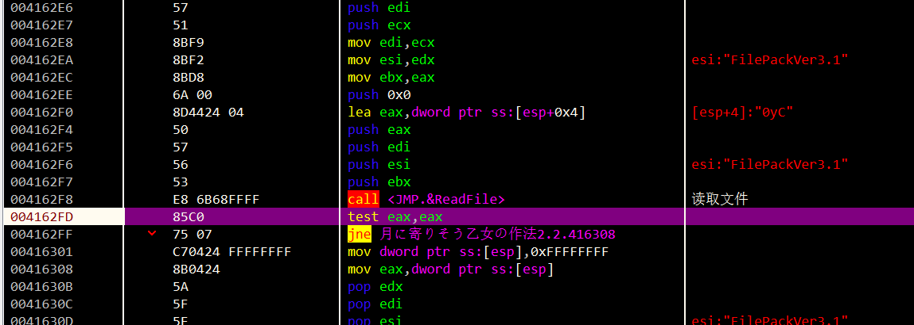
注意把 setfilepointer打开!!! 这里设置文件指针是设置源文件的 也就是data0.pack的地址
看日志

```
设置文件指针  句柄:370 偏移量:00  基准:2
设置文件指针  句柄:370 偏移量:00  基准:0
设置文件指针  句柄:370 偏移量:024D0DE0  基准:0
读取文件:  句柄:370 缓冲:19FAF7 字节数:1C
```

读取的就是文件最末的0x1C字节数据
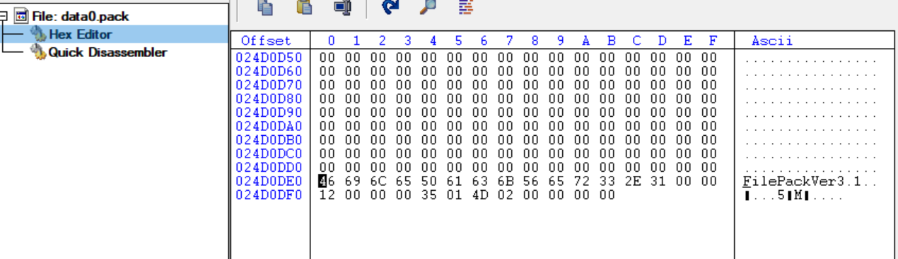
结合前面走弯路逆错文件的经验 可以分析出大致结构
开头的是`FilePack`的签名 后面`12 00 00 00` 应该是size之类的
然后的 `35 01 4D 02` 跟右边的offset很像 所以应该是某个入口点的指针 最后一个DWORD的0不知道什么含义

```c++
struct FilePack{
    char sign[0x10]; // version
    DWORD size; // ? unsure of which
    DWORD EntryAddress; // probably
    DOWRD unknown; // 0?
}
```

返回x32dbg 跳出这个函数 把上下的函数借助IDA写上标签便于识别
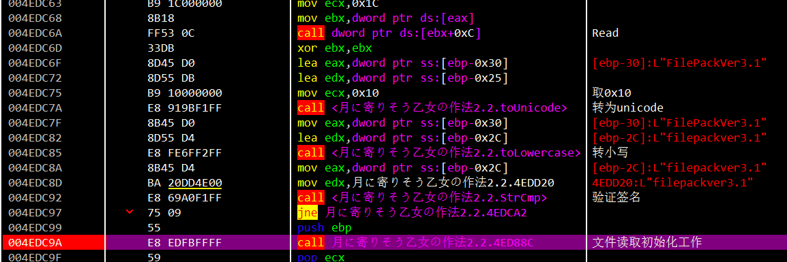
注意到取了前0x10 来验签

### 文件读取初始化

步进文件读取初始化的函数里
IDA可以很清楚的看清函数结构 关注SetPoint的日志
`设置文件指针  句柄:370 偏移量:024D09BC  基准:0`
然后后面Read 继续看日志
`读取文件:  句柄:370 缓冲:19F684 字节数:440`
跟踪出来发现确实从data0.pack `024D09BC`处读取了440(0x124)字节数据
其实往上翻翻可以发现这个在一个开头为 `HashVer1.4`的结构体的最末

Read过后做了一个比较奇怪的check: 检查检查结尾后的第一个byte是否`>=0 <=8` 若否就置为0
然后取eax:起始位置+24h 复制了0x100的数据到`[ecx+ebx+0x54]`的内存
后面就开始有计算hash和decrypt的了 结合IDA和动调
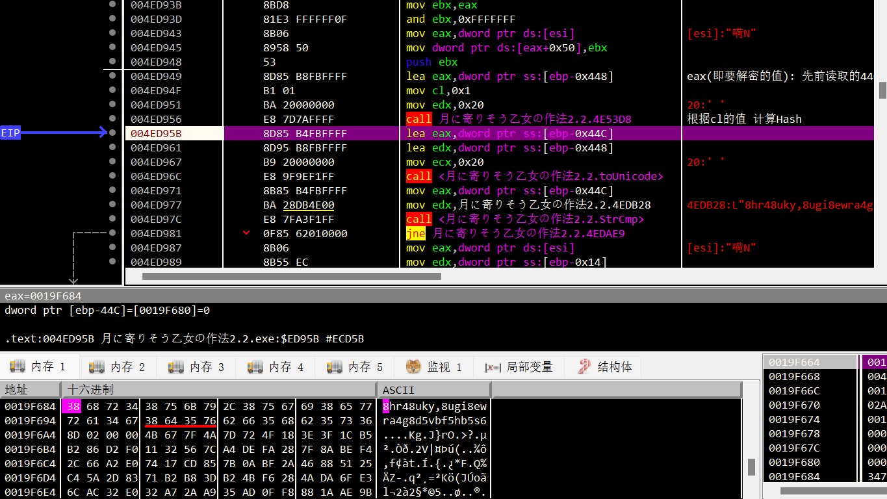
然后就是取0x20字节转unicode后与 `8hr48uky,8ugi8ewra4g8d5vbf5hb5s6`对比
其中关于Hash的计算以及decrypt的算法IDA一目了然 不需要过多深入的分析 解密时IDA开一个AutoComment照着XMM指令集写即可
可能其中会涉及到一些间接调用之类的 动调找也比较好找

这里发现只需要进入decrypt动调一些值即可
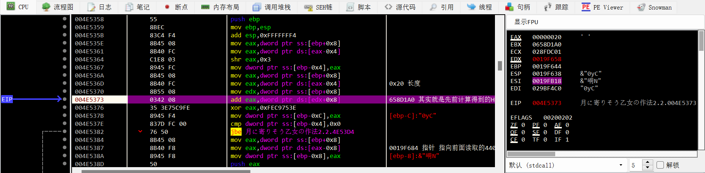
这里一个是长度 另一个就是先前计算得到的hash值 `0658D1A0`
其实和先前的hash有一点点小区别? 动调得到的hash函数返回eax是 `D658D1A0`
这样初始的 `*(_DWORD *)(a1 + 8)`和 `*(_DWORD *)(a1 - 4)`就得到了
还有一个 `*(__m64 **)(a1 - 8)` 动调发现是一个指向先前读取440字节数据的指针 也就是我们的解密源数据
然后取了0x20来解密
解出来的就是 `8hrxxx` 然后转unicode 验签

然后进行了一大堆赋值操作 注意细看
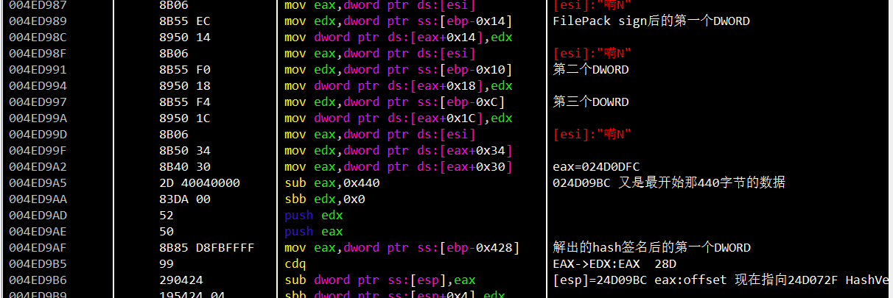
结合cdq我们可以知道 `FilePack`里面的Entry应该是QWORD类型 而且只有三个成员
所以可以写出`FilePack`结构

```c++
struct FilePack{
    char sign[0x10];
    DWORD size;
    QWORD EntryPoint;
}
```

然后又开始设置文件指针
`设置文件指针  句柄:35C 偏移量:024D072F  基准:0`
指向的正是data0中的HashVer结构体
然后调用CopyFrom 接着又构造了一个类
然后看日志发现 `读取文件:  句柄:35C 缓冲:296C5B0 字节数:28D`
查看对应内存
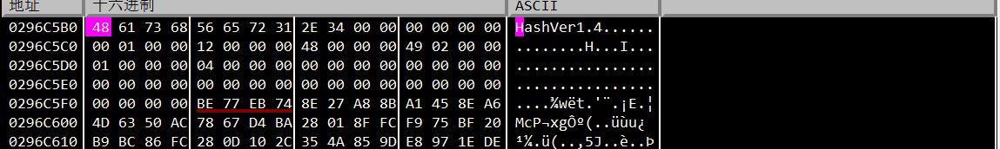
所以前面从data0复制HashVer到内存中

现在来关注之前取出的440字节的数据 不妨称作 HashData 因为Hash解密出一个签名
然后有个很关键的是签名后的第一个DWORD: 028D 是后面计算地址的offset

```c++
struct HashData{
    char sign[0x20]; //8hr...
    DWORD offset; // 028D
    char data[0x100]; //256字节数据
    DWORD unk; //先前检验data后一个字节 <0||>8就设置为0
    char Blank[0x2F8] //空字节占位
    FilePack filepack; // FilePack结构体
}
```

关注一下怎么通过 HashData找到HashVer的
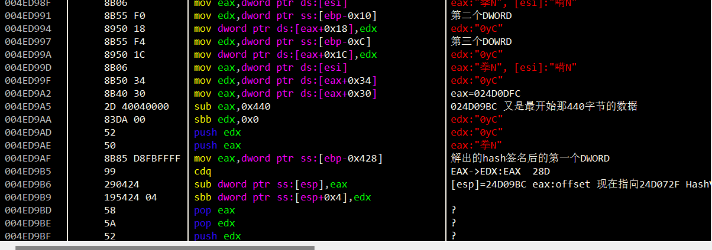
可以看到先是取出offset 028D 然后用HashData的地址去索引HashVer

接下来关注对HashVer结构体作了什么操作
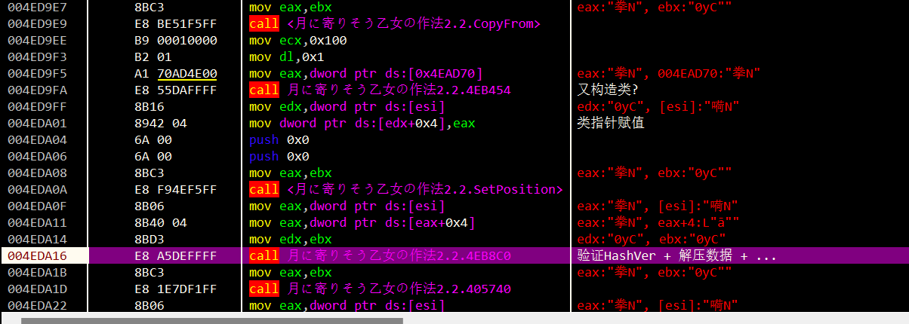
前面构造的类的指针是指向`HashVer`开头 所以可以确定下面是对这个结构体的处理
`sub_4EB8C0`函数在IDA能大致看出功能
先验签 然后解密 再Copy回内存
验签:
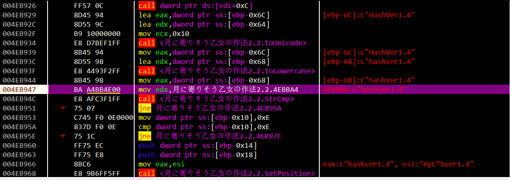
对HashVer的数据读取:
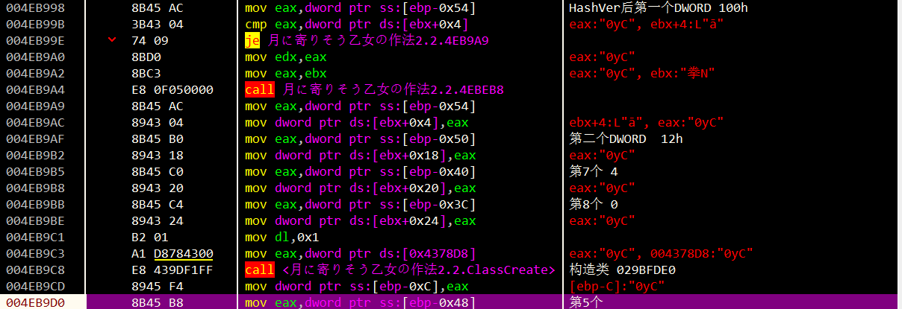
然后用CopyFrom往类中写入数据
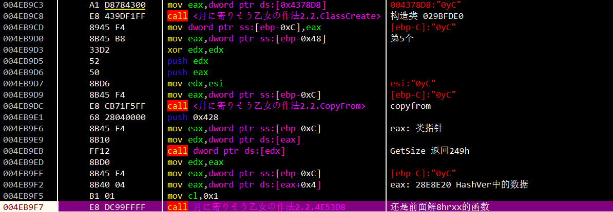
发现这个函数还是解出 `8hx...`的那个 将其重命名为decrypt
接下来出现了第二个解密函数
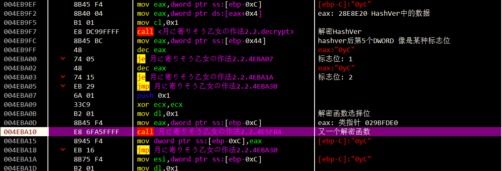

再看0296C5B0处的HashVer结构体 一些值的作用就清晰了
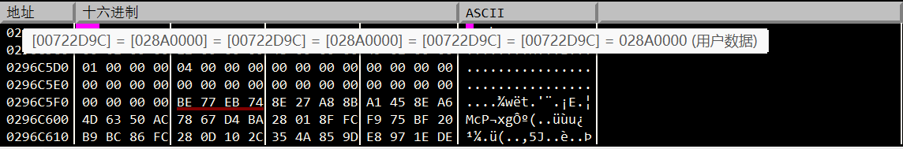
前面调用过GetSize 返回的是 249h 说明hashver后第四个DWORD就是size
前面又分析过了第五个DWORD是标志位 决定是否调用decrypt2

所以解密流程就是先对hashver的数据用decrypt解密 若标志位为1 继续进行decrypt2解密
decrypt2结合IDA+x32dbg动调数据来理解

一堆ReadFile 但是并没有调用API 所以需要手动进入找到读的那片内存
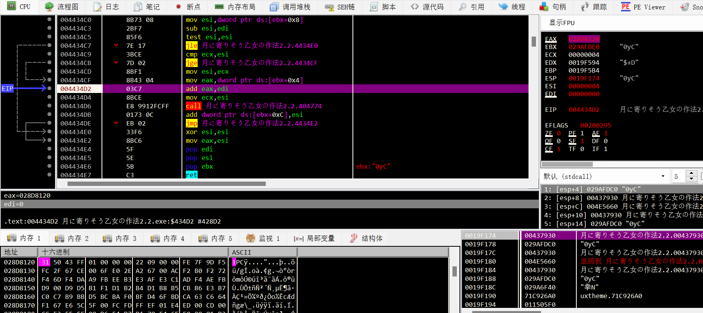
找几个寄存器试试就找到这块
接下来的Read都是在这片内存 028D8120
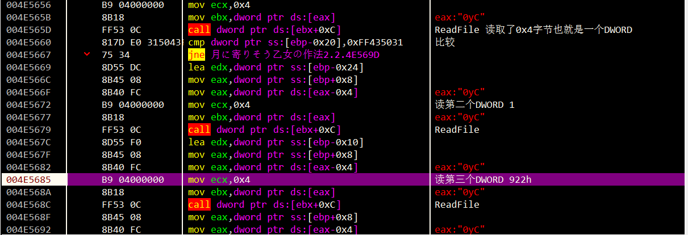
第一个DWORD肯定是验证 第二个多半是标志位 第三个是size
这里ReadFile读取的值是存在ecx寄存器里的
后面对size进行了一个检查 结合IDA: `v17<-[ebp-10h]` 也可以确定前面922h就是size

后面有一些间接寻址操作 结合动调来看
从004E5722开始
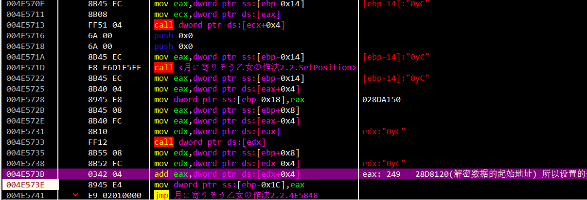
这里动调一下会发现有size 有待解密数据的起始地址 又结合IDA知道这就是 end指针
`idr617538_Move(v10, v11, 256);` 这句就是把前面建的[0~255]的表复制一份 原表是v10
接下来IDA反编译都比较清晰
注意到第85行`if ( (v12 & 1) == 1 ) ` 这里往前翻就知道是读取的第二个DWORD 也就是我们猜测的标志位1
其实这里就是一个数据类型格式的check
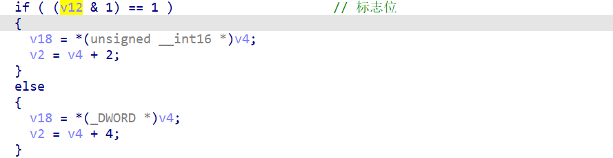
根据不同数据格式来移指针
标志位为1代表是WORD类型

最后注意下虽然看似只有一次if但是后面有个 `goto label36` 所以是个循环
这个循环中套的一个 栈+找index的解密
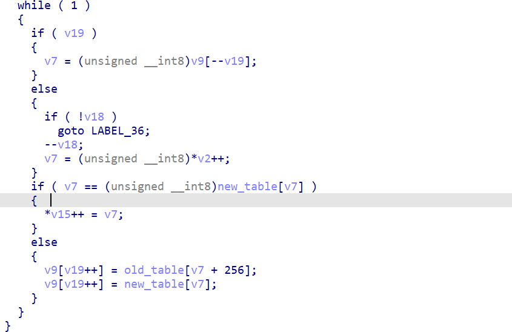
可以通过 `v15 <- v15 = (_BYTE *)*((_DWORD *)v16 + 1);` 知道v15就是指向以v16起始的空间
最后返回解密后的类指针

为了统一 对这部分解密的数据结构装一个结构体 命名为 Decrypt2DataHead(跟教程一样)
因为这是decrypt2之前的头部结构 很容易写出来
Decrypt2DataHead:

```c++
struct Decrypt2DataHead{
    DWORD sign; //FF435031
    DWORD isWord; // 1:unsigned __int16
    DWORD size; // 922h
}
```

找到解密数据的内存 028DA150 然后跑完decrypt2
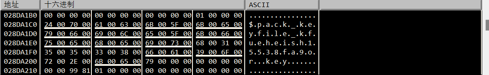
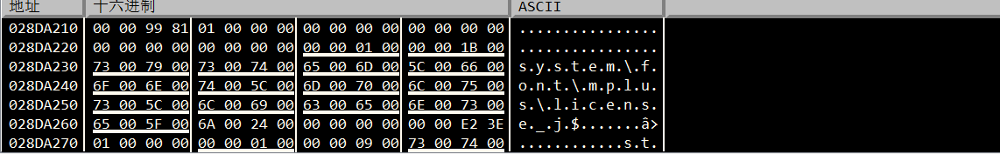

解出来的都是文件名 所以HashVer的数据存的应该是这个pack里打包的文件名
可以数下有多少个文件 18个 12h 刚好对应HashVer的第二个Dword 同时也跟FilePack里的size对应上了
HashVer的结构:

```c++
struct HashVer{
    char sign[0x10]; // HashVer1.4
    DWORD table_size;  // 100h 可能是表的大小???
    DWORD file_cnt; // 12h
    DWORD unk; // 48h
    DWORD dataSize; // 249h
    DWORD signal; // 标志位 1 则decrypt2
    ...
    char data[0x249]; // 加密的数据
}
```

跳出函数 回到 4EDA1B
现在我们还在文件读取初始化函数中 刚刚结束了验签+解密数据等操作
然后新设置了文件指针 `设置文件指针  句柄:350 偏移量:024D0135  基准:0`
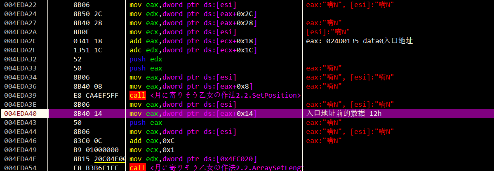
发现就是 `FilePack`的几个数据 size和EnrtyPoint
然后进行了一个 12次(size次)的循环 那么应该就是分别解密每个文件的数据了
IDA可以很直观的看出来:
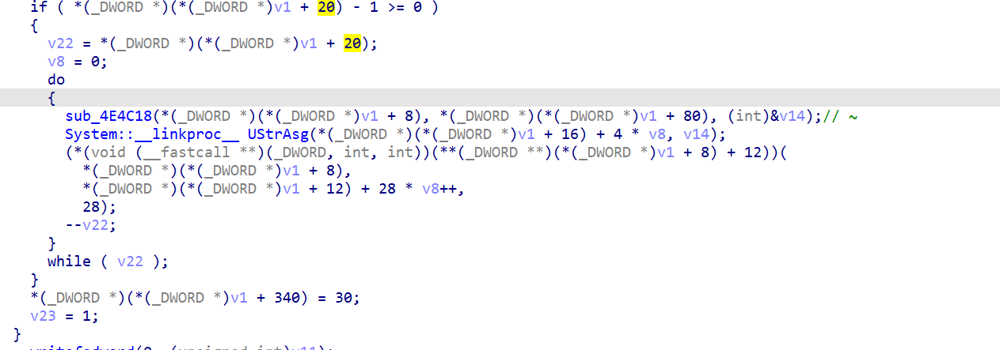
`sub_4E4C18`就是关键的解密函数
先IDA看个大概结构
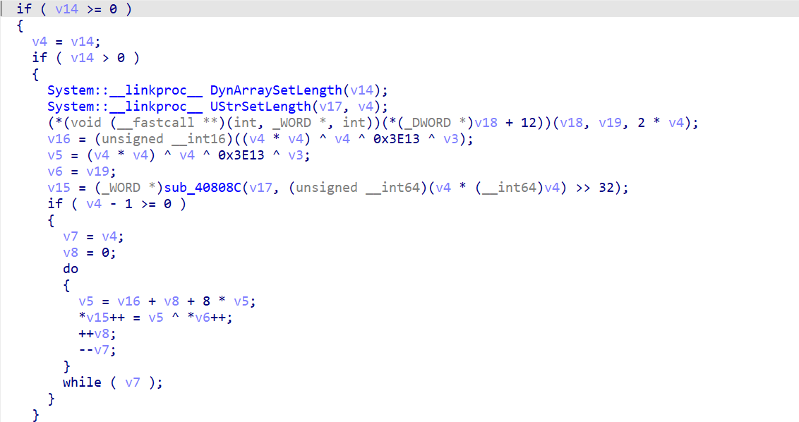
动调看一看间接调用即可
可以发现这部分指向了HashData
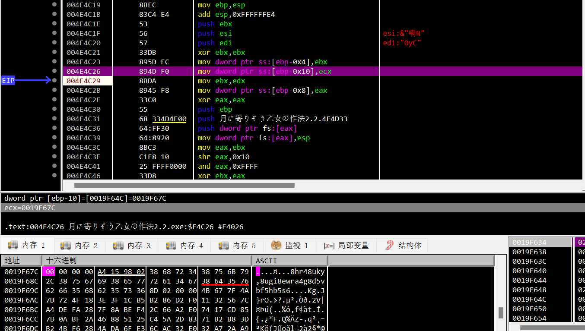
注意到传入的第二个参数` *(_DWORD *)(*(_DWORD *)v1 + 80)` 也就是edx 指向的是之前算出的Hash值 `0658D1A0`
然后又ReadFile `读取文件:  句柄:364 缓冲:19F642 字节数:2`
读了 `00 24`
hashdata前面有一堆 发现是一些版权声明的日文
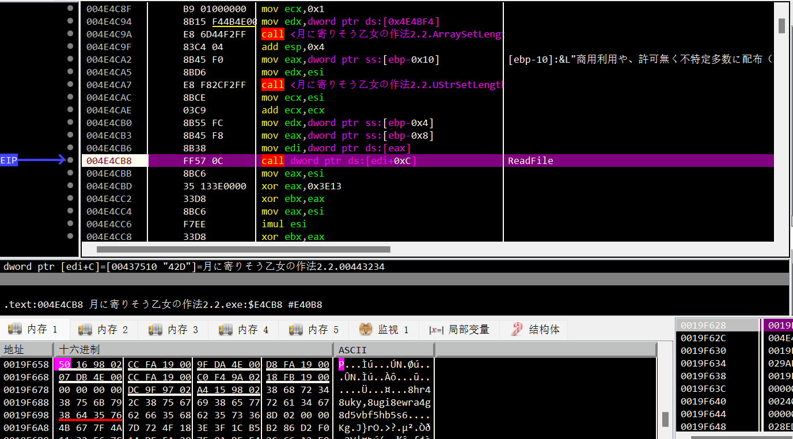
然后又有ReadFile `读取文件:  句柄:364 缓冲:2981650 字节数:48`
读的字节数是2*v4 v4的初始值是24h
这里的48和HashVer的那个unk的值可能有关联
然后就是解密了 IDA很明晰
这里v15取的应该是解密数据存放内存的指针(修改了数据格式 unicode转了一下 WORD类型)
do-while循环了24h次
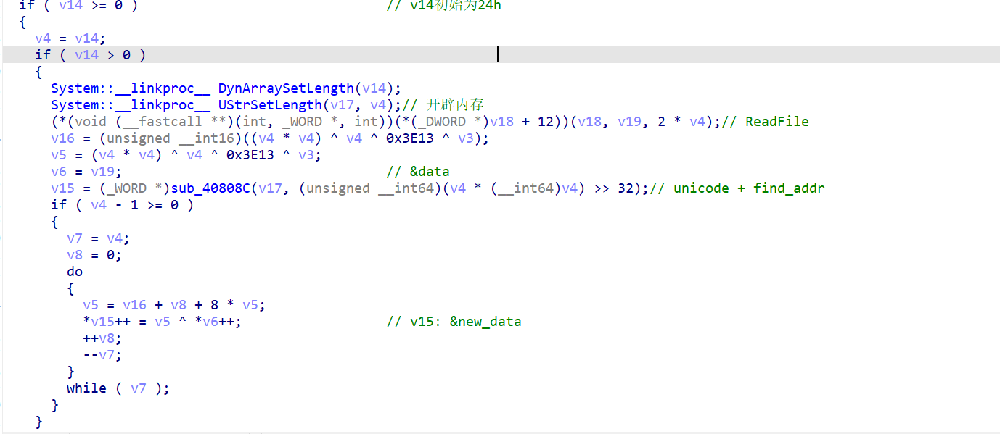
解密完后回到之前的循环继续下个文件的解密
日志打印如下:

```
读取文件:  句柄:364 缓冲:19F642 字节数:2
断点已设置在 004E4CB8 ！
INT3 断点于 月に寄りそう乙女の作法2.2.004E4CB8 (004E4CB8)!
读取文件:  句柄:364 缓冲:2981650 字节数:48
读取文件:  句柄:364 缓冲:28D6118 字节数:1C
INT3 断点于 月に寄りそう乙女の作法2.2.004EDA9A (004EDA9A)!
读取文件:  句柄:364 缓冲:19F642 字节数:2
读取文件:  句柄:364 缓冲:29AFDC8 字节数:12
读取文件:  句柄:364 缓冲:28D6134 字节数:1C
INT3 断点于 月に寄りそう乙女の作法2.2.004EDA9A (004EDA9A)!
读取文件:  句柄:364 缓冲:19F642 字节数:2
读取文件:  句柄:364 缓冲:29CB858 字节数:18
读取文件:  句柄:364 缓冲:28D6150 字节数:1C
INT3 断点于 月に寄りそう乙女の作法2.2.004EDA9A (004EDA9A)!
读取文件:  句柄:364 缓冲:19F642 字节数:2
读取文件:  句柄:364 缓冲:299F590 字节数:2C
读取文件:  句柄:364 缓冲:28D616C 字节数:1C
INT3 断点于 月に寄りそう乙女の作法2.2.004EDA9A (004EDA9A)!
读取文件:  句柄:364 缓冲:19F642 字节数:2
读取文件:  句柄:364 缓冲:299F590 字节数:26
读取文件:  句柄:364 缓冲:28D6188 字节数:1C
INT3 断点于 月に寄りそう乙女の作法2.2.004EDA9A (004EDA9A)!
读取文件:  句柄:364 缓冲:19F642 字节数:2
读取文件:  句柄:364 缓冲:299F590 字节数:28
读取文件:  句柄:364 缓冲:28D61A4 字节数:1C
INT3 断点于 月に寄りそう乙女の作法2.2.004EDA9A (004EDA9A)!
读取文件:  句柄:364 缓冲:19F642 字节数:2
读取文件:  句柄:364 缓冲:29B4D58 字节数:30
读取文件:  句柄:364 缓冲:28D61C0 字节数:1C
INT3 断点于 月に寄りそう乙女の作法2.2.004EDA9A (004EDA9A)!
读取文件:  句柄:364 缓冲:19F642 字节数:2
读取文件:  句柄:364 缓冲:29B4D58 字节数:30
读取文件:  句柄:364 缓冲:28D61DC 字节数:1C
INT3 断点于 月に寄りそう乙女の作法2.2.004EDA9A (004EDA9A)!
读取文件:  句柄:364 缓冲:19F642 字节数:2
读取文件:  句柄:364 缓冲:29BBE28 字节数:36
读取文件:  句柄:364 缓冲:28D61F8 字节数:1C
INT3 断点于 月に寄りそう乙女の作法2.2.004EDA9A (004EDA9A)!
读取文件:  句柄:364 缓冲:19F642 字节数:2
读取文件:  句柄:364 缓冲:29BBE28 字节数:36
读取文件:  句柄:364 缓冲:28D6214 字节数:1C
INT3 断点于 月に寄りそう乙女の作法2.2.004EDA9A (004EDA9A)!
读取文件:  句柄:364 缓冲:19F642 字节数:2
读取文件:  句柄:364 缓冲:29B4D58 字节数:34
读取文件:  句柄:364 缓冲:28D6230 字节数:1C
INT3 断点于 月に寄りそう乙女の作法2.2.004EDA9A (004EDA9A)!
读取文件:  句柄:364 缓冲:19F642 字节数:2
读取文件:  句柄:364 缓冲:29B4D58 字节数:34
读取文件:  句柄:364 缓冲:28D624C 字节数:1C
INT3 断点于 月に寄りそう乙女の作法2.2.004EDA9A (004EDA9A)!
读取文件:  句柄:364 缓冲:19F642 字节数:2
读取文件:  句柄:364 缓冲:29BBF48 字节数:38
读取文件:  句柄:364 缓冲:28D6268 字节数:1C
INT3 断点于 月に寄りそう乙女の作法2.2.004EDA9A (004EDA9A)!
读取文件:  句柄:364 缓冲:19F642 字节数:2
读取文件:  句柄:364 缓冲:297A038 字节数:52
读取文件:  句柄:364 缓冲:28D6284 字节数:1C
INT3 断点于 月に寄りそう乙女の作法2.2.004EDA9A (004EDA9A)!
读取文件:  句柄:364 缓冲:19F642 字节数:2
读取文件:  句柄:364 缓冲:28CBDD0 字节数:56
读取文件:  句柄:364 缓冲:28D62A0 字节数:1C
INT3 断点于 月に寄りそう乙女の作法2.2.004EDA9A (004EDA9A)!
读取文件:  句柄:364 缓冲:19F642 字节数:2
读取文件:  句柄:364 缓冲:297A038 字节数:54
读取文件:  句柄:364 缓冲:28D62BC 字节数:1C
INT3 断点于 月に寄りそう乙女の作法2.2.004EDA9A (004EDA9A)!
读取文件:  句柄:364 缓冲:19F642 字节数:2
读取文件:  句柄:364 缓冲:28CBEA0 字节数:56
读取文件:  句柄:364 缓冲:28D62D8 字节数:1C
INT3 断点于 月に寄りそう乙女の作法2.2.004EDA9A (004EDA9A)!
读取文件:  句柄:364 缓冲:19F642 字节数:2
读取文件:  句柄:364 缓冲:29B4D58 字节数:34
读取文件:  句柄:364 缓冲:28D62F4 字节数:1C
```

然后来分析这些读取的究竟是些什么数据
看都是固定长度1C的数据 多分析几组
`00 00 00 00 00 00 00 00 23 10 00 00 23 10 00 00 00 00 00 00 01 00 00 00 12 40 63 EB`
`23 10 00 00 00 00 00 00 57 02 00 00 F6 06 00 00 01 00 00 00 01 00 00 00 23 F2 E4 E4`
`7A 12 00 00 00 00 00 00 64 03 00 00 64 12 00 00 01 00 00 00 01 00 00 00 BC 0C 7A ED`
`DE 15 00 00 00 00 00 00 1C 12 00 00 1C 12 00 00 00 00 00 00 01 00 00 00 0C E4 5E FF`
...
`0C 4F 00 00 00 00 00 00 A5 0A 00 00 A5 0A 00 00 00 00 00 00 01 00 00 00 EA C6 DC F9`

由日志可以看出1C这组地址是连续的 很像一个结构体数组
由第一二组 => 00 00 00 00 + 23 10 00 00 = 23 10 00 00
大致能确定前两个DWORD组成一个QWORD(结合前面的经验)代表地址 然后第三个DWORD代表size(相邻地址的间隔)
然后发现一个很有趣的点 观察第四个和第五个DWORD
从第五个DWORD入手 当其为0的时候 发现第三个DWORD的size和第四个DWORD的值一样
而为1的时候 第四个比第三个大
由于这是在FilePack的文件读取初始化中 且我们以及解密了文件名 那么现在解的就是文件本体了
可以推断第五个DWORD是标志位 代表大小是否改变 那么第四个DWORD就应该是解密后的size了  至于最后一个DWORD完全看不出来 可能是CRC校验之类的
由于这个结构体的功能是 索引地址+提供解密所需的标志参数 将其命名为FileEntry(还是取一样的)
结构如下:

```c++
struct FileEntry{
    QWORD offset; // DWORD2:DWORD1
    DWORD size;
    DWORD decrypted_size; // 解密后的size
    DWORD isCompressed; // 0/1 标志位
    DWORD unk1; // all_the_same : 1
    DWORD unk2; // maybe hash/CRC
}
```

### 文件解密

然后要等所有文件的文件名都解完过后才进入文件解密
前面的流程大致是把每个datax.pack的文件名都解密了 然后都读取了FileEntry
结束后日志发现有个 `读取文件:  句柄:360 缓冲:3CED440 字节数:1023`
关键的解密函数在sub_4ED454 但找不到是怎么进到这个函数的...
IDA看大致结构:
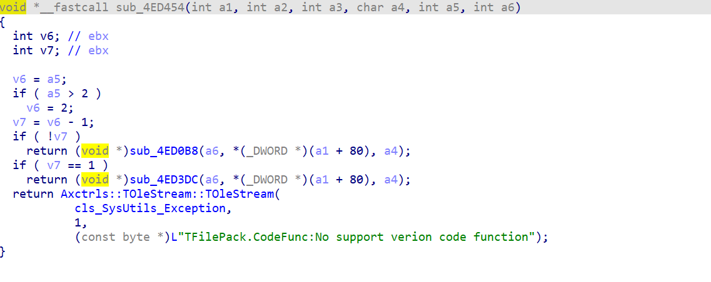
根据传入的参数来选择不同分支
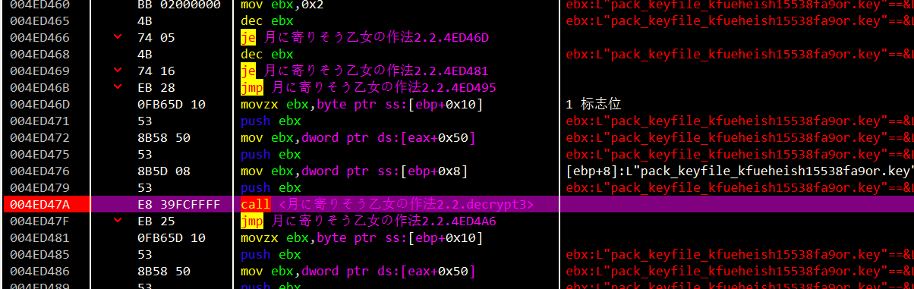
进入decrypt3后又有个分支
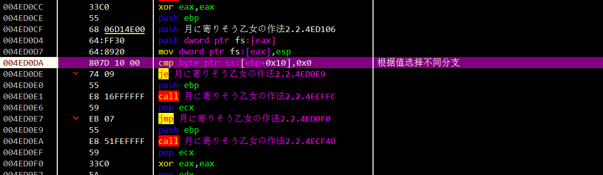
但其实IDA看一模一样... 只是写法有一点差异 实现功能完全相同

近月2所有都是decrypt3 从前面分析的`FileEntry`结构体可知
IDA看
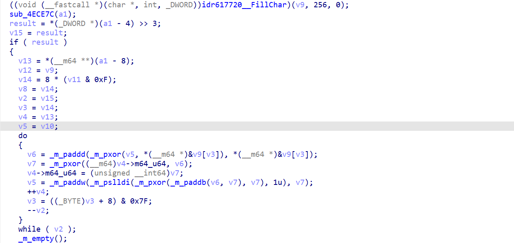
由前面的经验知道`sub_4ECE7C(a1);`就是算出一个hash供后面作为key解密
进入hash函数
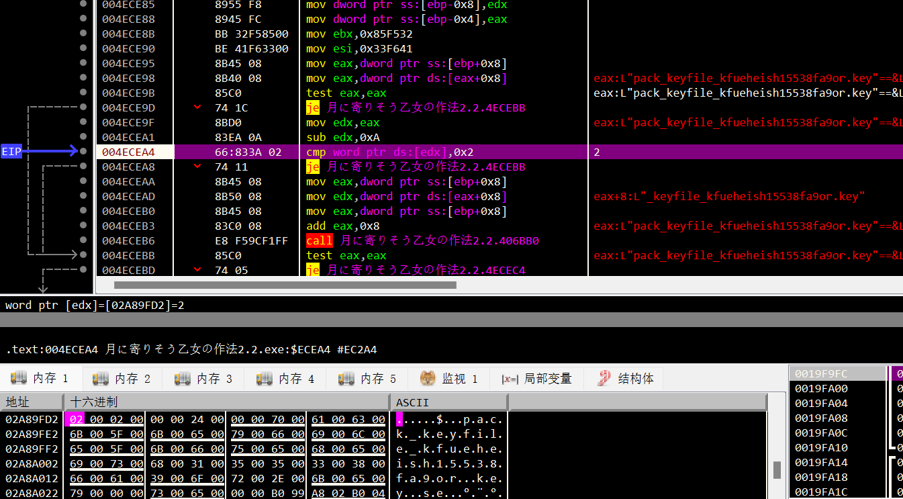

先是用 "pack_keyfile_kfueheish15538fa9or.key"对两个key又做了加密
然后进入sub_4ECE40算HASH
这里的传参要仔细动调
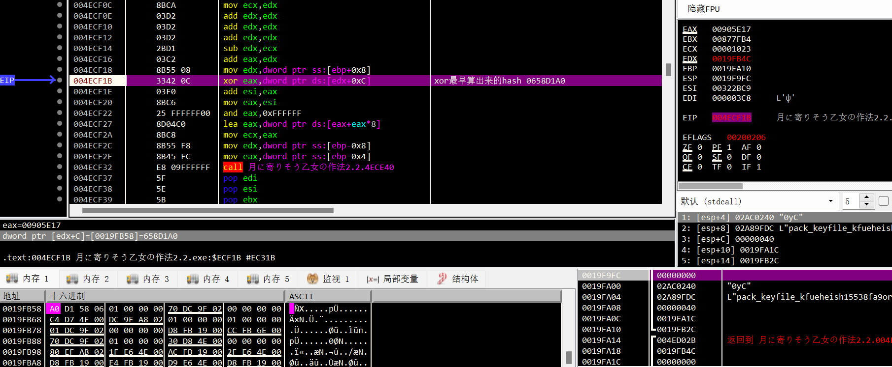
而另一个调一调发现是前面传入的1023 也就是读取文件的size
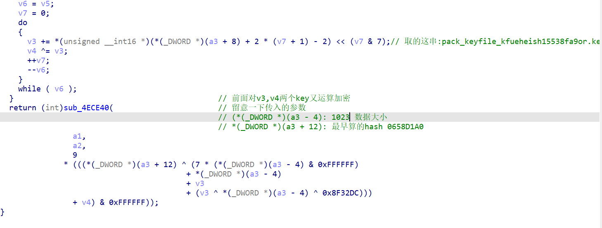
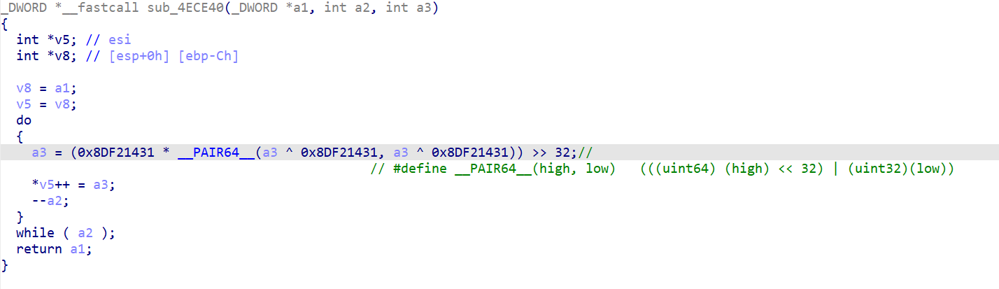


XMM指令集开个自动注释就都能弄懂 `_m_pslldi`是DWORD逻辑左移
然后动调看看哪个值指向hash[]
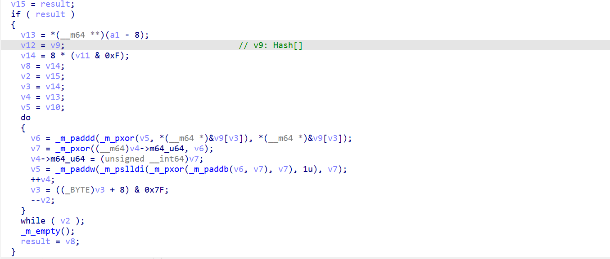
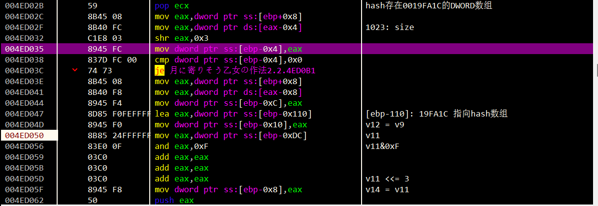

到此 近月2的文件解密已经告一段落了
近月2都用的decrypt3 而 万华镜用的都是decrypt4

总流程:


# 万华镜5
经过前面近月2的逆向 对qlie引擎有了一定的了解
万华镜5和近月2最大的不同就在于前者采用的是decrypt4

wtm谢谢你... 伟大的汉化组汉化完加了个壳...
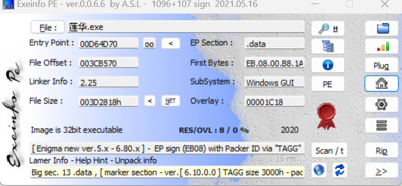

先看看万华镜4 感觉逻辑应该差不了太多
第一个难点 如何定位到decrypt4的地方?
当然可以再跟着近月2的步骤调试一遍
但有个更好用的方法:
我们知道这两款游戏的引擎是一样的 所以基本特征肯定是相同的
我们复制近月2的decrypt3附近的字节码
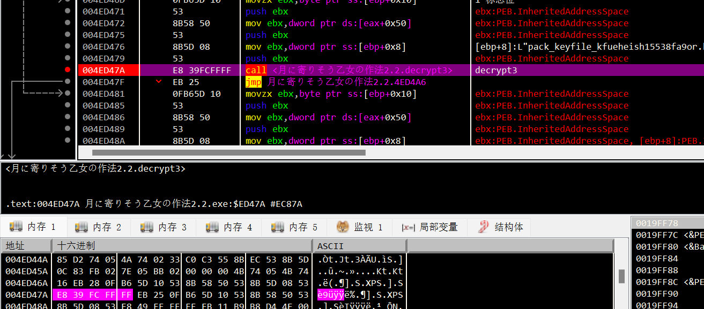
然后在x32dbg的内存布局里搜索匹配特征
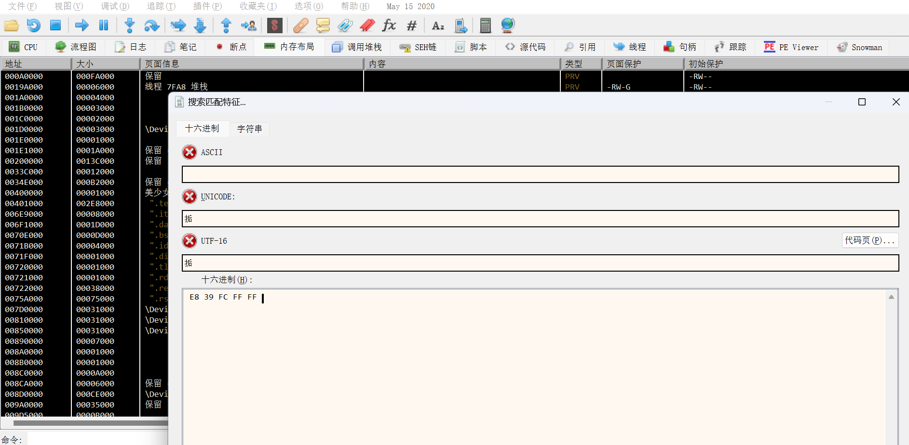
嗖的一下 就搜到了~
成功定位
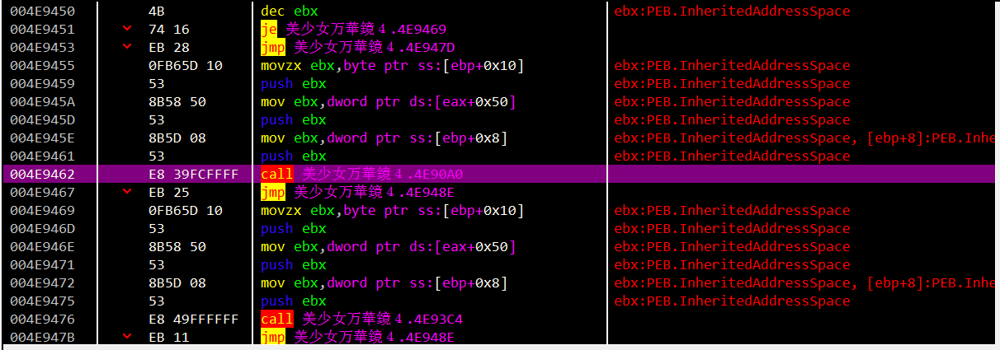

很离谱的是为什么万华镜4大部分都是decrypt3啊...
终于断到decrypt4过后就可以开始逆了~
将近月2的decrypt3和镜的decrypt4对比着看很容易看出区别

## decrypt4
开始分析
进入后跟decrypt3一样 也有两个分支 但是都是大同小异 功能完全一样
而且对比近月2和镜4发现decrypt4函数也一模一样
所有关键参数甚至连变量命名都一样 所以可以放心逆镜4的decrypt4

IDA大致对比一下dec3和dec4
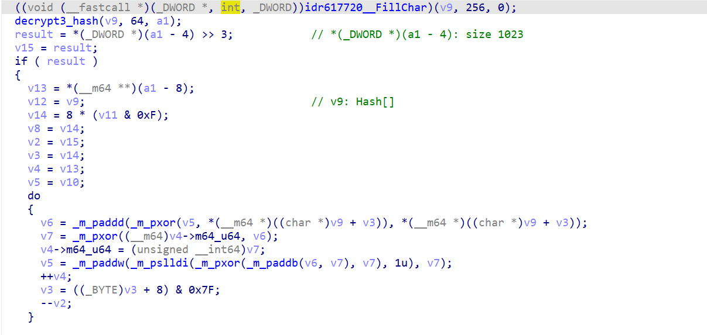
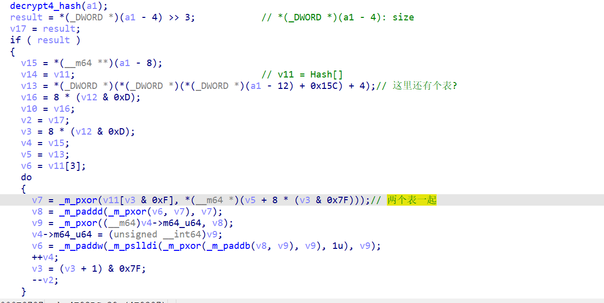

首先是hash函数实现不同 然后就是dec4多了一个hash表/key表 用的双表加密而非3的单表加密

但hash函数也只是改了些加密常量而已 具体算法都没变

接下来关注那个多出来的表
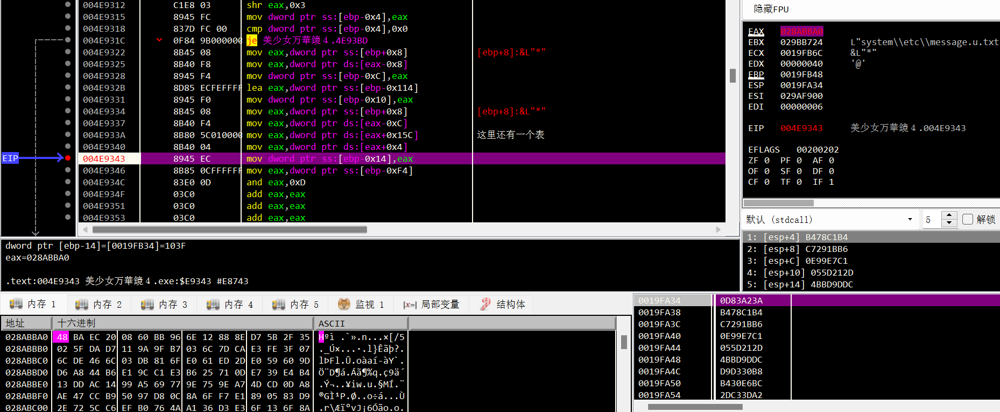
确实有另一个table在 总长度为0x400 bytes
很巧的是教程用镜5 不同的文件调用decrypt4时的table长度是一样的 内容不一样
那就很自然想知道这个table或者key数组在哪里被怎么算出来的?

### 回溯找`key[]`
教程教了一个很棒的方法 用强大的CheatEngine来搜索这个key数组
搜索选项调成搜索`字节数组`
就搜索开头的几个DWORD
`48 BA EC 20 08 60 BB 96 6E 12 88 8E D7 5B 2F 35 02 5F DA D7 11 9A 9F B7 03 6C 7D CA E3 FE 3F 07`
发现已经可数了
扫镜4:
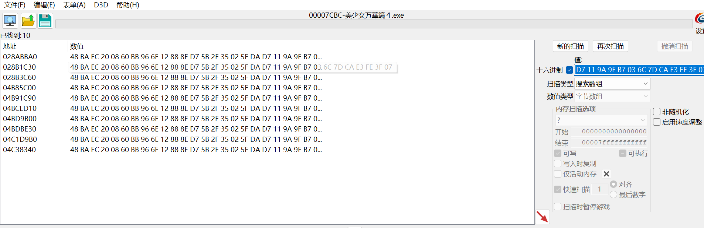
接下来就是逐步往前回溯了 去找在哪个调用点的时候刚好算出了key
还想着看能不能通过IDA的立即数搜索缩小一下范围 发现0x400出现的太多 还是老老实实看交叉引用吧...

往上回溯到进入调用dec3,4的函数 断在dec3发现已经算出key了...
跟之前猜测有误 说明这个key也许是固定的?
继续往上回溯
发现有两个可能 下断点标记一下 发现在第二个进入的
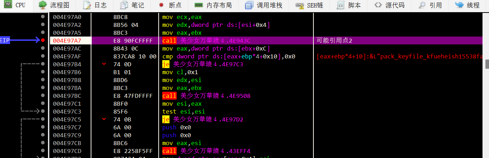

从`sub_4E966C`再往上回溯
下断点动调<- `sub_4E9800`
<-`sub_4EA4B4` 还有key[]...
<-`sub4EC5AC`
再回溯就有很多分支了...
直接一键在所有分支设断点 发现断在一个比较奇怪的地址
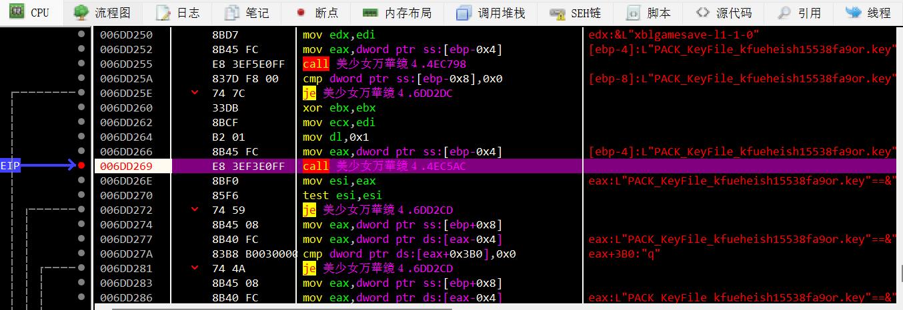
地址是6开头 不是用户区的4也不是系统区的7 而是引擎的代码?
来到了`sub_6DD224`函数
<-`sub_6DD9B8`
发现在这个开头的时候就没有key了!!!
!!!!!!!!!!!!!!!!!!!!!!!!!!!!!!!
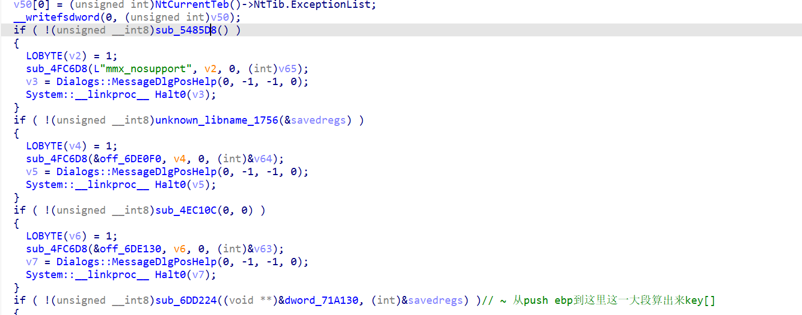
没多少了 慢慢排除
挨个if下断点CE来找
得到结论:
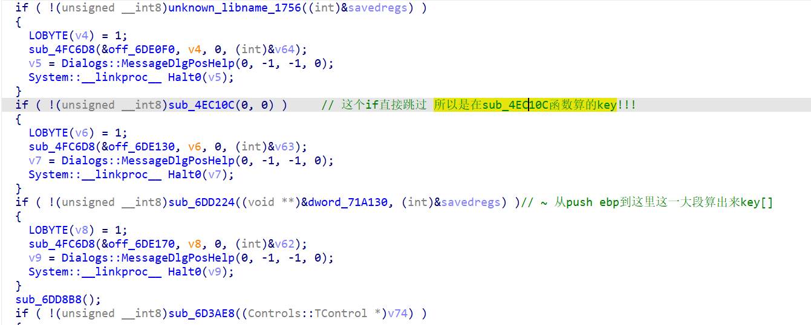
就是在sub_4EC10C里面的do-while来算的key
但4这里面看起来完全不像是在计算key的啊...
采取一步一段然后CE查的方法 定位到这里
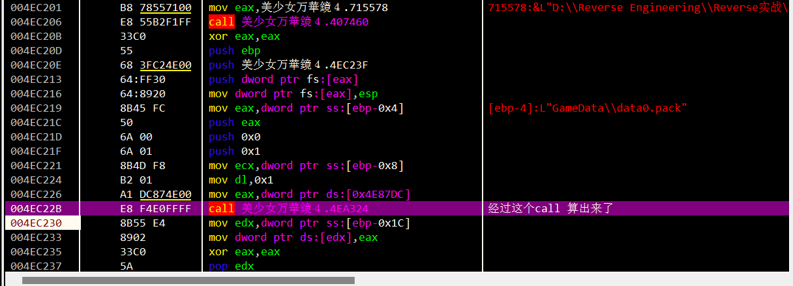
发现貌似引用了data0.hash这种
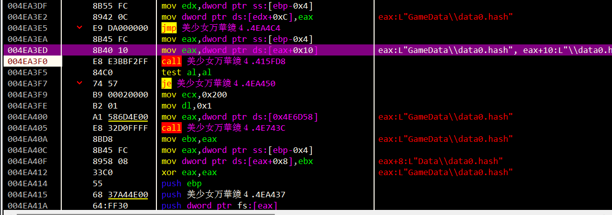
这就尴尬了...
在想是不是4和5的区别???
...服了...
也就是5之前的镜是用前面文件解密得到的datax.hash来计算???或是直接copy过来???
后续代码编写后运行也发现确实有较大区别
先还是按照镜5的代码来写
当然逆向的基本流程已经全部实操过了 等找到镜5的无壳版本再找一遍key的生成函数

### 镜5回溯找 `key[]`
终于找到无壳的版本了~
再回溯找一遍key
有了镜4找dec4和key的经验 很快能定位到这里
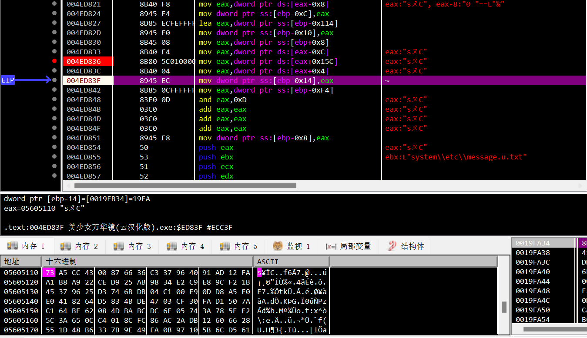
然后就慢慢地CE回溯吧
跟到这里发现已经有PACK/key字样了
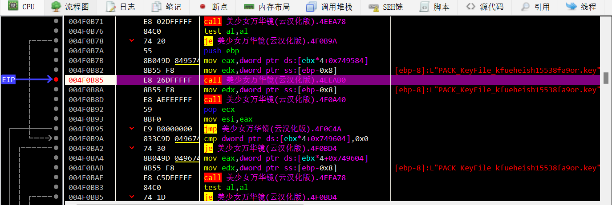
再往前可以追到`710E8D` 这是引擎代码的区域
最后定位到这个分界点
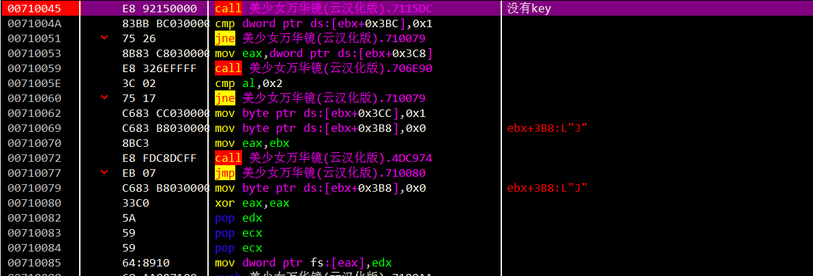
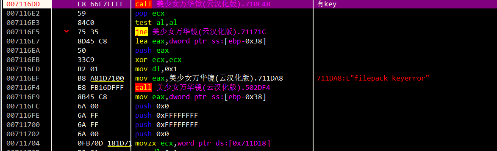
最终确定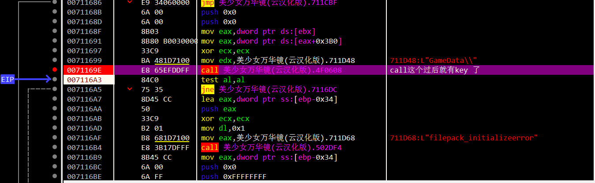
确定到某个具体的call后 里面还有很多看似没有计算key的 采取逐个下断 缩小范围
(发现跟镜4貌似是一样的... 看来还是没跟踪到每一个call...)
进一步缩小到这里 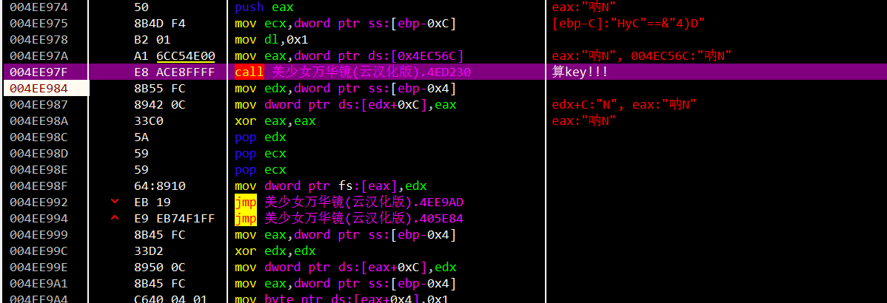
Finally 终于定位到了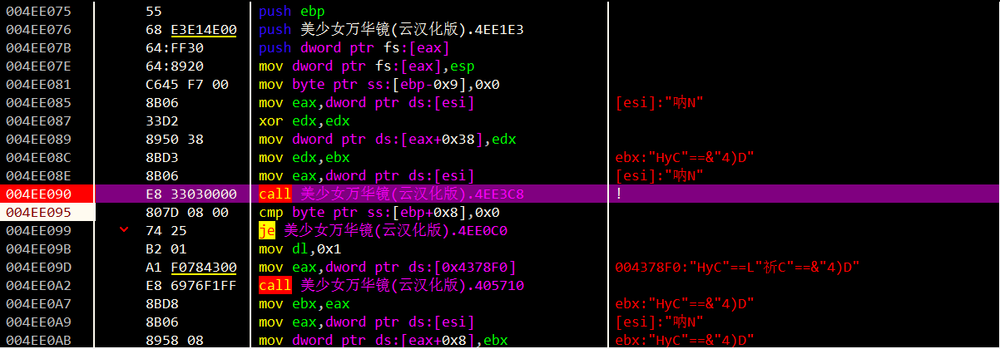
IDA看
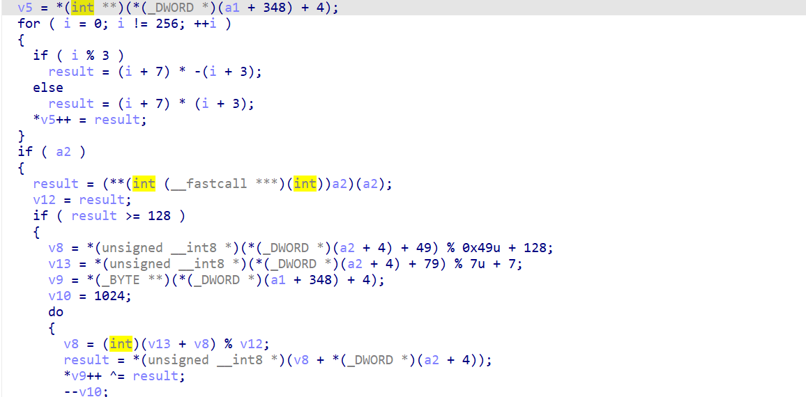
动调跟踪看间接调用
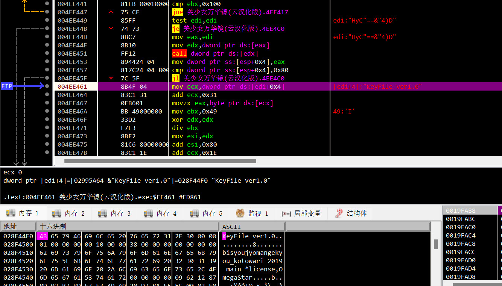
table就存在`[ebp]`中
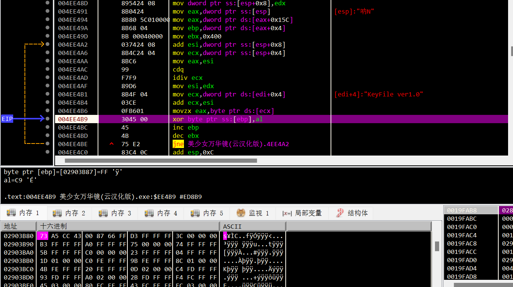

🎉🎉🎉

# 解密代码
到了最后的环节了 根据前面得到的所有信息来编写镜5的解包程序

自己尝试写到decrypt3_hash 后面是在写不动了... 也不是很想再开x32dbg去找对应offset了 再加上没有镜5也不好找decrypt4_hash
在佬的源代码上做了些修改 加了一些自己的理解 希望有朝一日能够独立写出这样的代码 把万华镜4类似的独立解包吧~
```c++
#include<bits/stdc++.h>
#include<Windows.h>
#include<mmintrin.h>
#define QWORD unsigned __int64
#define __PAIR64__(high, low)   (((QWORD) (high) << 32) | (DWORD)(low))
using namespace std;
struct FilePackVer
{
    char sign[0x10];
    DWORD filecount;
    int entry_low;
    int entry_high;
};
struct HashData
{
    char sign[0x20];
    DWORD HashVerSize;
    char data[0x100];
    DWORD Unkown;
    char Blank[0x2F8];
    FilePackVer fpacker;
};
struct Dencrypt2DataHead
{
    DWORD sign;
    DWORD isWordType;
    DWORD size;
};
struct Dencrypt2DataOutput
{
    BYTE* data;
    DWORD len;
};
struct FileEntry
{
    DWORD offset_low;
    DWORD offset_hight;
    DWORD size;
    DWORD dencrypted_size;
    DWORD isCompressed;
    DWORD EncryptType;
    DWORD hash;
};
DWORD Tohash(void* data, int len)
{
    if (len < 8)return 0;
    //准备工作
    __m64 mm0 = _mm_cvtsi32_si64(0);
    __m64 mm1;
    __m64 mm2 = _mm_cvtsi32_si64(0);
    DWORD key = 0xA35793A7;
    __m64 mm3 = _mm_cvtsi32_si64(key);
     mm3 = _m_punpckldq(mm3, mm3);
     __m64* pdata=(__m64*)data;
    for (size_t i = 0; i < (len >> 3); i++)
    {
        mm1 = *pdata;
        pdata++;
        mm2 = _m_paddw(mm2, mm3);
        mm1 = _m_pxor(mm1, mm2);
        mm0 = _m_paddw(mm0, mm1);
        mm1 = mm0;
        mm0 = _m_pslldi(mm0, 3);
        mm1 = _m_psrldi(mm1, 0x1D);
        mm0 = _m_por(mm1, mm0);
    }
    mm1 = _m_psrlqi(mm0, 32);
    DWORD result = _mm_cvtsi64_si32(_m_pmaddwd(mm0, mm1));
    _m_empty();
    return result;
}
void dencrypt(void* data,unsigned int len, DWORD hash)
{
    if (len >> 3 == 0)
        return;
    DWORD key1 = 0xA73C5F9D;
    DWORD key2 = 0xCE24F523;
    DWORD key3 = (len + hash)^ 0xFEC9753E;
    __m64 mm7 = _mm_cvtsi32_si64(key1);
    mm7 = _m_punpckldq(mm7, mm7);
    __m64 mm6 = _mm_cvtsi32_si64(key2);
    mm6 = _m_punpckldq(mm6, mm6);
    __m64 mm5 = _mm_cvtsi32_si64(key3);
    mm5 = _m_punpckldq(mm5, mm5);
    __m64* datapos = (__m64*)data;
    __m64 mm0;
    for (size_t i = 0; i < len >> 3; i++)
    {
        mm7 = _m_paddd(mm7, mm6);
        mm7 = _m_pxor(mm7, mm5);
        mm0 = *datapos;
        mm0 = _m_pxor(mm0, mm7);
        mm5 = mm0;
        *datapos = mm0;
        datapos++;
    }
    _m_empty();
    return;
}
Dencrypt2DataOutput* dencrypt2(void* data, unsigned int len,unsigned int dencrypted_len, DWORD hash)
{
    char old_table[0x100],new_table[0x100],other[0x100];
    for (size_t i = 0; i < 0x100; i++)
        old_table[i] = i;
    Dencrypt2DataHead* head = (Dencrypt2DataHead*)data;
    if (head->sign != 0xFF435031)
    {
        cout << "Errod! 0xFF435031" << endl;
        return nullptr;
    }
    if (head->size> 0x20000000u)
    {
        cout << "Error! 0x20000000" << endl;
        return nullptr;
    }
  
    Dencrypt2DataOutput* Output = new Dencrypt2DataOutput();
    Output->len = dencrypted_len;
    Output->data = new BYTE[dencrypted_len + 1];
    BYTE* outputbuff = Output->data;
    BYTE* datapos = (BYTE*)data + sizeof(Dencrypt2DataHead);
    BYTE* data_start = datapos;
    BYTE* data_end = (BYTE*)data + len;
    BYTE chr;
    int t_pos;
    int size;
    while (data_start < data_end)
    {
        chr = *data_start;
        datapos = data_start + 1;
        memcpy(new_table, old_table, 0x100);
        t_pos = 0;
        while (1)
        {
            if (chr > 0x7Fu)
            {
                t_pos += chr - 127;
                chr = 0;
            }
            if (t_pos > 0xFF)
            {
                break;
            }
            for (size_t i = 0; i < chr + 1; i++)
            {
                new_table[t_pos] = *datapos++;
                if (t_pos != (unsigned __int8)new_table[t_pos])
                {
                    other[t_pos] = *datapos++;
                }
                ++t_pos;
            }
            if (t_pos > 0xFF)
                break;
            chr = *datapos++;
        }
        if ((head->isWordType & 1) == 1)
        {
            size = *(WORD*)datapos;
            data_start = (datapos + 2);
        }
        else
        {
            size = *(DWORD*)datapos;
            data_start = (datapos + 4);
        }
        stack<BYTE> stack; // unsigned char!
        while (1)
        {
            BYTE result;
            if (stack.size())
            {
                result = stack.top();
                stack.pop();
            }
            else
            {
                if (!size)
                {
                    break;
                }
                size--;
                result = *data_start;
                data_start++;
            }
            if (result == (BYTE)new_table[result])
            {
                *outputbuff = result;
                outputbuff++;
            }
            else
            {
                stack.push(other[result]);
                stack.push(new_table[result]);
            }
        }
    }
    return Output;
}
void DencryptFileName(void* data,int character_count,DWORD hash)
{
    int key = ((hash >> 0x10) & 0xFFFF) ^ hash;
    key = character_count ^ 0x3E13 ^ key ^ (character_count * character_count);
    DWORD ebx = key;
    DWORD ecx;
    WORD* datapos = (WORD*)data;
    for (size_t i = 0; i < character_count; i++)
    {
        ebx = ebx << 3;
        ecx = (ebx + i + key) & 0xFFFF;
        ebx = ecx;
        *datapos = (*datapos ^ ebx) & 0xFFFF;
        datapos++;
    }
}
DWORD* dencrypt3_hash(int hashlen,int datalen,void* filename,int character_count,DWORD Hash)
{
    DWORD key1 = 0x85F532;
    DWORD key2 = 0x33F641; 
    WORD* character = (WORD*)filename; // 指向文件名
    size_t i = 0;
    int v5 = character_count;
    int v6 = v5;
    do{
        key1 = key1 + (*character << (i & 7));
        key2 ^= key1;
        i++;
        v6--;
        character++;
    }while(v6);
    DWORD key3 = 9*((key2+(Hash^(7*(datalen&0xFFFFFF)+datalen+key1+(key1^datalen^0x8F32DC))))&0xFFFFFF);
    //
    QWORD a3 = key3;
    DWORD* result = new DWORD[hashlen];
    for (size_t i = 0; i < hashlen; i++)
    {
		a3 = (0x8DF21431 * __PAIR64__(a3 ^ 0x8DF21431, a3 ^ 0x8DF21431)) >> 32;
        *(result+i) = a3;
    }
    return result;
}
void dencrypt3(void* data,int len, void* filekey)
{
    //0x34相当于4字节数据+0xD
    DWORD key1 = (*((DWORD*)filekey + 0xD) & 0xF) << 3;
    BYTE* datapos = (BYTE*)data, * fkey = (BYTE*)filekey;
    __m64 mm7 = *((__m64*)filekey + 0x3); //这里0x3相当于BYTE的0x18
    __m64 mm6, mm0, mm1;
    for (size_t i = 0; i < len >>3; i++)
    {
        mm6 = *(__m64*)(fkey + key1);
        mm7 = _m_pxor(mm7, mm6);
        mm7 = _m_paddd(mm7, mm6);
        mm0 = *(__m64*)datapos;
        mm0 = _m_pxor(mm0, mm7);
        mm1 = mm0;
        *(__m64*)datapos = mm0;
        mm7 = _m_paddb(mm7, mm1);
        mm7 = _m_pxor(mm7, mm1);
        mm7 = _m_pslldi(mm7, 0x1);
        mm7 = _m_paddw(mm7, mm1);
        datapos += 8;
        key1 = (key1 + 8) & 0x7F;
    }
    _m_empty();
    return;
}
BYTE* dencypt4_keyfilehash(void* data,int len)
{
    int* keyfilehash = new int[0x100];
    int* keyfilehash_pos = keyfilehash;
    for (size_t i = 0; i < 0x100; i++)
    {
        if (i % 3 ==0)
        {
            *keyfilehash_pos = (i + 3u) * (i + 7u);
        }
        else
        {
            *keyfilehash_pos = -(i + 3u) * (i + 7u);
        }
        keyfilehash_pos++;
    }
    int key1 = *(BYTE*)((BYTE*)data + 0x31);
    key1 = (key1 % 0x49) + 0x80;
    int key2 = *(BYTE*)((BYTE*)data + 0x1E + 0x31);
    key2 = (key2 % 7) + 7;
    BYTE* keyfilehash_pos_byte = (BYTE*)keyfilehash;
    for (size_t i = 0; i < 0x400; i++)
    {
        key1 = (key1 + key2) % len;
        *keyfilehash_pos_byte ^= *(BYTE*)((BYTE*)data + key1);
        keyfilehash_pos_byte++;
    }
    return (BYTE*)keyfilehash;
}
DWORD* dencrypt4_hash(int hashlen, int datalen, void* filename, int character_count, DWORD hash)
{
    DWORD key1 = 0x86F7E2; //ebx
    DWORD key2 = 0x4437F1; //esi
    WORD* character = (WORD*)filename;
    for (size_t i = 0; i < character_count; i++)
    {
        key1 = key1 + (*character << (i & 7));
        key2 ^= key1;
        character++;
    }
    DWORD key3 = (datalen ^ key1 ^ 0x56E213) + key1 + datalen; //eax
    int key4 = (datalen & 0xFFFFFF) * 0xD; //edx
    key3 += key4;
    key3 ^= hash;
    key3 = ((key3 + key2) & 0xFFFFFF) * 0xD;
    unsigned long long rax = key3;
    DWORD* result = new DWORD[hashlen];
    for (size_t i = 0; i < hashlen; i++)
    {
        rax = (unsigned long long)(rax ^ 0x8A77F473u) * (unsigned long long)0x8A77F473u;
        rax = ((rax & 0xFFFFFFFF00000000) >> 32) + (rax & 0xFFFFFFFF);
        rax = rax & 0xFFFFFFFF;
        result[i] = rax;
    }
    return result;
}
void dencrypt4(void* data, int len, void* filekey,void* keyfilehash)
{
	DWORD key1 = (*((BYTE*)filekey + 0x20) & 0xD)*8; // v3 = 8 * (v12 & 0xD); filekey作为esp?  v12:[esp+20h]
    BYTE* datapos = (BYTE*)data, * fkey = (BYTE*)filekey,* keyfilekey = (BYTE*)keyfilehash; // keyfilekey: 另一张hash表
    __m64 mm7 = *((__m64*)filekey + 0x3); //这里0x3相当于BYTE的0x18
    __m64 mm6, mm0, mm1,mm5;
    for (size_t i = 0; i < len >> 3; i++)
    {
        mm6 = *(__m64*)(fkey + ((key1 & 0xF) << 3));
        mm5 = *(__m64*)(keyfilekey + ((key1 & 0x7F) << 3));
        mm6 = _m_pxor(mm6, mm5);
        mm7 = _m_pxor(mm7, mm6);
        mm7 = _m_paddd(mm7, mm6);
        mm0 = *(__m64*)datapos;
        mm0 = _m_pxor(mm0, mm7);
        mm1 = mm0;
        *(__m64*)datapos = mm0;
        mm7 = _m_paddb(mm7, mm1);
        mm7 = _m_pxor(mm7, mm1);
        mm7 = _m_pslldi(mm7, 0x1);
        mm7 = _m_paddw(mm7, mm1);
        datapos += 8;
        key1 = (key1 + 1) & 0x7F;
    }
    _m_empty();
    return;
}
FILE* WideChar_CreateFile(const wchar_t* filename) // 建文件(包括dir)
{
    wchar_t* pos = (wchar_t*)filename;
    while (1)
    {
        pos = wcschr(pos, '\\');
        if (pos == nullptr)
        {
            break;
        }
        wchar_t* dir = new wchar_t[pos - filename + 1]();
        wcsncpy(dir, filename, pos - filename);
        _wmkdir(dir);
        pos++;
        delete dir;
    }
    FILE* hfile = _wfopen(filename, L"wb");
    return hfile;
}
int main()
{
	ios::sync_with_stdio(false);
	cout<<"Please Input The route of datax.pack:\n";
    string filename;
    cin >> filename;
    FILE* hfile;
    hfile = fopen(filename.c_str(), "rb");
    _fseeki64(hfile, 0, 2);
    fpos_t file_size = _ftelli64(hfile);
    //读取filepack头
    _fseeki64(hfile, file_size - 0x1C, 0); // 读取最后0x1C个字节
    FilePackVer* filepacker = new FilePackVer();
    fread(filepacker, 0x1C,1 , hfile);
    if (string(filepacker->sign) != "FilePackVer3.1\x00\x00")
    {
        cout << "FilePackVer Error!" << endl;
        return 0;
    }
    //读取HashData
    HashData *hashdat = new HashData();
    _fseeki64(hfile,file_size-0x440,0); // 利用前面的FilePack结构体减去0x440的offset就是HashData结构体位置
    fread(hashdat,1,0x440,hfile);
    //数据的设置
    if (hashdat->Unkown > 8 || hashdat->Unkown < 0)
    {
        hashdat->Unkown = 0;
    }
    DWORD hash = Tohash(&hashdat->data,0x100) & 0x0FFFFFFF;
    //解码签名
    dencrypt(&hashdat->sign, 0x20, hash);
    if (strncmp(hashdat->sign,"8hr48uky,8ugi8ewra4g8d5vbf5hb5s6",0x20))
    {
        cout << "HashData Error!" << endl;
        return 0;
    }
    //开始解密文件
    DWORD64 entry = ((long long)filepacker->entry_high << 32) + (long long)filepacker->entry_low; // cdq
    BYTE* keyfilehash = nullptr;
    for (size_t i = 0; i < filepacker->filecount; i++)
    {
        _fseeki64(hfile, entry, 0);
        WORD character_count;
        fread(&character_count, 2, 1, hfile);
        wchar_t* name = new wchar_t[character_count + 1]();
        //因为UTF16字节数是ASCII的两倍，所以要乘2
        fread(name, 1, 2 * character_count, hfile);
        //解密文件名
        DencryptFileName(name, character_count, hash);
        FileEntry *fentry = new FileEntry();
        fread(fentry, 1, 0x1C, hfile);
        entry = _ftelli64(hfile);
        //文件读取
        char* filedata = new char[fentry->size];
        _fseeki64(hfile, ((long long)fentry->offset_hight << 32) + (long long)fentry->offset_low, 0);
        fread(filedata, fentry->size, 1, hfile);
  
        //解密文件
        DWORD* filehash = nullptr;
        if (fentry->EncryptType == 1)
        {
            filehash = dencrypt3_hash(0x40, fentry->size, name, character_count, hash);
            dencrypt3(filedata, fentry->size, filehash);
            if (wcsncmp(name, L"pack_keyfile_kfueheish15538fa9or.key", character_count) == 0)
            {
                keyfilehash = dencypt4_keyfilehash(filedata, fentry->size);
            }
        }
        else if(fentry->EncryptType == 2)
        {
            filehash = dencrypt4_hash(0x40, fentry->size, name, character_count, hash);
            dencrypt4(filedata, fentry->size, filehash, keyfilehash);
        }
        Dencrypt2DataOutput* Output = nullptr;
        if (fentry->isCompressed)
        {
            Output = dencrypt2(filedata, fentry->size, fentry->dencrypted_size, hash);
        }
        else
        {
            Output = new Dencrypt2DataOutput();
            Output->data = (BYTE*)filedata;
            Output->len = fentry->dencrypted_size;
        }
        //保存文件
        wstring filename = wstring(name);
        filename = L"ExtractData\\" + filename;
        FILE* hOut = WideChar_CreateFile(filename.c_str());
        std::fwrite(Output->data, Output->len, 1, hOut);
        std::fclose(hOut);
        delete fentry, name, filedata, filehash, Output;
    }
  
    std::fclose(hfile);
}


```

# 写在最后
52pj那篇神作对于没接触过这种类型的逆向来说还是挺有难度的 无论是x32dbg的调试技巧还是一些数据敏感以及对结构体的重视都需要时间来适应
希望我的工作能给看到这篇文章的你带来一点启发

可以说万华镜是我最早接触到逆向工程的一个契机
去年暑假找万华镜玩的时候想要解出里面的CG 网上的Extractor都解不出来
兜兜转转就找到了52pj这篇神作~
去年11月初也尝试过开始逆 但逆不了一点...
现在又过了几个月 又学习到了更多知识/逆向经验 磕磕绊绊也能将引擎摸索个大概
犹记几个月前还将逆出万华镜5作为逆向的终极目标(🤣) 看来目标还可以更大呐~

也许这就是逆向工程的魅力所在吧~ 能让我花整整一个周末 一直做一件事
当跟着一条条汇编抽丝剥茧 还原各种结构体 找到各个关键算法时 那种喜悦是难以言表的
希望能一直带着这种热忱继续学习逆向工程 

**`<<< Reversing <<<`**