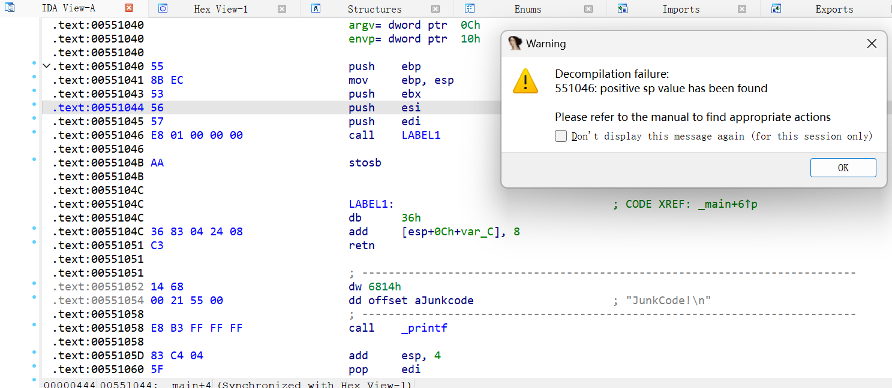

研究多种花指令以及去除方法

环境:
vs2022 注意要用32位生成 64位不支持`__asm` 内嵌汇编


## jz jnz

写一个最简单的demo
```c
#include<stdio.h>
#include<Windows.h>
signed main() {
	__asm {
		jz label1;
		jnz label1;
		_emit 0xE8
	};
label1:
	__asm {
		mov ecx, 2;
		adc cl, 9;
		jb short $ + 1;
	};
	printf("jz jnz JunkCode!\n");
}
```

IDA反编译效果如下:


或者直接_emit写机器码
```c
#include<stdio.h>
#include<Windows.h>
signed main() {
    __asm {
        _emit 075h 
        _emit 2h
        _emit 0E9h
        _emit 0EDh
    }
	printf("JunkCode!\n");
	return 0;
}
```

这种混淆效果更好 但由于特征单一 也更容易脚本去除

## 
设置恒真恒假的语句

demo:
```c
#include<stdio.h>
#include<Windows.h>
signed main() {
	__asm {
		push edx;
		inc edx;
		xor edx, edx;
		test edx, edx;
		jnz label1
		jz label2
	label1:
		_emit 0x7a
	label2 :
		pop edx;
		mov ecx, 2;
		adc cl, 9;
		jb short $ + 1;
	};
	__asm {
		clc
		jnz label3;
		_emit 0xa2
	label3:
	};
	printf("JunkCode!\n");
}
```

设置了一堆跳转分支固定(恒等)
IDA反编译效果:


可以发现能够隐藏我们真实的语句了(printf)

##
call+ret类型
这里要理解这两个指令的本质:
```
call:  push func_ret_addr + jmp func_addr
ret: pop eip
```

demo:
```c
#include<stdio.h>
#include<Windows.h>
signed main() {
	__asm {
		call LABEL1;
		_emit 0xaa;
	LABEL1:
		add dword ptr ss : [esp] , 8;
		ret;
		_emit 0x14;
	};

	printf("JunkCode!\n");
}
```

一些寄存器的值需要动调看看


刚好+8覆盖了ret和花指令的长度

IDA的反编译效果:


再结合前面的混淆就能更好的隐藏真实语句


##

扰乱堆栈  使堆栈不平衡 不影响执行但是影响IDA 反编译

简单demo:
```c
#include<stdio.h>
#include<Windows.h>
signed main() {
	__asm {
		test eax, 0;
		jz label1;
		add esp,1;
	label1:
	};
	printf("JunkCode!\n");
	return 0;
}
```
尽管是一个永真跳转 但IDA对于false分支也会解析 所以会出现堆栈不平衡

IDA会报warning 还是能正常反编译


可以编写更复杂的堆栈指令来扰乱反编译

##
通过非法调用API的固定返回值来构造永真跳转
类似这种:
```c
#include<stdio.h>
#include<Windows.h>
void junkcode() {
    int r3 = 0;
    LoadLibraryA(NULL);
    __asm {
        cmp eax, 0;
        jne lebel2;
        je label;
    label:
        call label3;
    label3:
        add dword ptr ss : [esp] , 8;
        ret;
        _emit 0xE8;
    };

    
lebel2:
    __asm __emit 0xFF;
}
signed main() {
    __asm {
        _emit 75h;
        _emit 3;
        _emit 74h;
        _emit 2;
        _emit 0xFF
    };
    junkcode();
	return 0;
}
```

通过已知确定的返回值(0)来构造永真跳转


花指令逆向分析:

针对不同类型的花指令我们可以有不同的处理方法

1._emit 0xE8类型
E8对应的是call指令
写在junkcode段会IDA会加4个字节的地址偏移 导致整体识别错误

```c
__asm {
     jz label;
     jnz label;
     _emit 0xE8
 label:
}
```


那怎么patch 呢?
将 E8删掉即可

就可以正常识别了


2._emit E9
E9是jmp的机器码


demo:
```c
#include<stdio.h>
#include<Windows.h>
void junkcode() {
    __asm {
        jmp l1;
        _emit 0xaa;
    l2:
        ret;
        _emit 0x90;
    l1:
        call l2;
    };
}
int qpow(int a,int b) {
    int tmp = 1;
    while (b) {
        if (b & 1)tmp *= a;
        junkcode();
        a *= a;
        b >>= 1;
    }
    printf("JunkCode!\n");
    return tmp;
}
signed main() {
    __asm {
        _emit 75h;
        _emit 2;
        _emit 74h;
        _emit 1;
    };
    qpow(1,2);
	return 0;
}
```

看看IDA反编译效果


可以发现我们原本的qpow快速幂逻辑已经被识别错误了


拿几道题目来分析

1.NewStarCTF2023 | week5 fish
[题目链接](https://buuoj.cn/challenges#[NewStarCTF%202023%20%E5%85%AC%E5%BC%80%E8%B5%9B%E9%81%93]%E9%B1%BC)

IDA看汇编


明显的jz/jnz花指令
把机器码显示打开
分析发现


所以我们把 74 03 75 01 后面的那个字节nop掉即可

ida_python脚本:
```py
start = 0x401000
end = 0x402000
while start<end:
    if((get_wide_byte(start)==0x74) and (get_wide_byte(start+2)==0x75)):
        ida_bytes.patch_byte(start+4,0x90)
    start += 1
print("[+] OK !")
```

处理完后选中整个main C后P即可看到正确反编译结果


后续就是一个简单的blowfish加密 不在这里关心的范畴

2.DubheCTF2024 | Destination
题目在攻防世界有

程序采用触发 `__debugbreak` 异常处理跳转到`sub_4140D7`


汇编跟过去发现很多花指令


这就是前面讨论过的通过修改`[esp]`的值更改返回地址实现跳转
多看几处


也就是
`E8 00 00 00 00 83 04 24 05 C3` 这串
直接nop即可
但注意到还有这种


nop前面的同时还要
对后面 `0F 84 0F 85` 这种跳转指令进行处理
以上面图为例 我们把`0F 84 48 17 00 00` nop掉
如果是 `0F 85 0F 84` 就直接nop后jmp 后面不用管

花指令去除脚本如下:
```py
from tqdm import *
binfile = open("Destination.exe","rb").read()

founds = []
index = binfile.find(b'\xE8\x00\x00\x00\x00\x83\x04\x24\x05\xC3')
# find all junkcode
while index!=-1:
    founds.append(index)
    index = binfile.find(b'\xE8\x00\x00\x00\x00\x83\x04\x24\x05\xC3',index+1) #! index+1 ! 不然死循环了...
    print(index)
    
binfile = bytearray(binfile)
print(len(founds))
# replace all matches

for found in founds:
    patch = ["nop"]*10 # call $+5 这一段可以全部nop
    instr = binfile[found+10:found+12]
    # 处理 jnz jz 花指令
    if instr == b'\x0F\x84' or instr == b'\x0F\x85':
        if instr == b'\x0F\x84':
            patch += ["nop"]*6 # 把jnz全部nop
        elif instr == b'\x0F\x85':
            patch += ["nop","jmp"]+["pass"]*4
        next_instr = binfile[found+16:found+18]
        if next_instr == b'\x0F\x84' or next_instr == b'\x0F\x85':
            if next_instr == b'\x0F\x84':
                patch += ["nop"]*6 # 把jnz全部nop
            elif next_instr == b'\x0F\x85':
                patch += ["nop","jmp"]+["pass"]*4
    
    for i in range(len(patch)): # 替换回机器码
        if patch[i] == "nop":
            binfile[found+i] = 0x90
        elif patch[i] == "jmp":
            binfile[found+i] = 0xE9

open("Patched_Destination.exe","wb").write(binfile)

```

patch过后得到的:


发现jmp来jmp去的 一次指令一次jmp
处理方法 将`sub_4140D7`开头的far call 改为near call
然后alt+p调一下函数范围就可以正常反编译了

[处理后的附件](https://n0zom1z0.lanzouj.com/i3qbT1syz9pi)

然后就能得到`sub_4140D7`的F5结果 后续xxtea和`sub_413F77`加密不在讨论范畴内


3.看雪.TSRC 2017CTF秋季赛
[题目附件](https://github.com/ctf-wiki/ctf-challenges/blob/master/reverse/anti-debug/2017_pediy/ctf2017_Fpc.exe)
