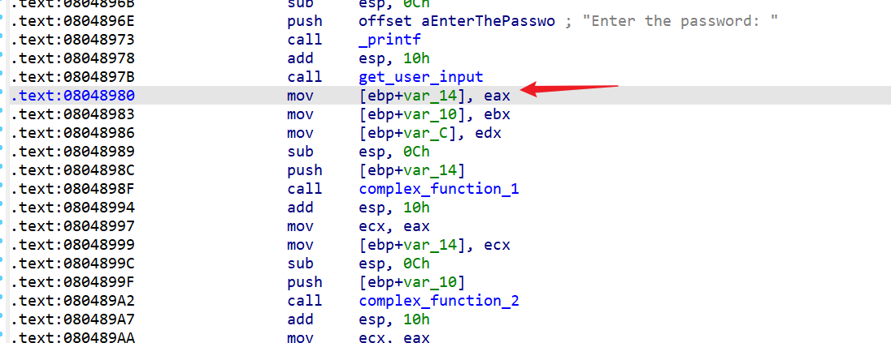
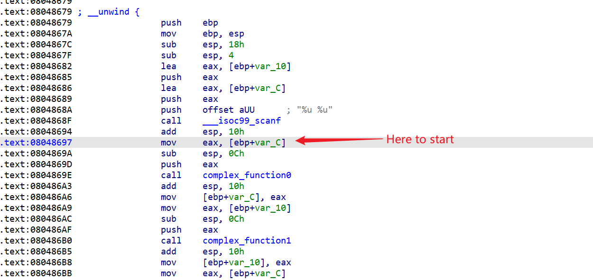

# 

## 源码

# 题目练习

## [网鼎杯 2020 青龙组]singal
[signal.exe](./angr/题目/signal.exe)
最简单的angr使用

```py
from angr import *

project = Project("./signal.exe") # 创建项目 加载二进制文件
state = project.factory.entry_state() # 创建state
sim = project.factory.simgr(state) # 创建sim
sim.explore(find = 0x40175E,avoid  = 0x4016E6) # 约束条件

if sim.found:
    res = sim.found[0]
    res = res.posix.dumps(0)
    print(f"[+] Success! The Solution is {res.decode()}")
```


## [WUSTCTF2020]funnyre
[funnyre](./angr/题目/funnyre)
angr + claripy的稍进阶用法

这题加了一堆花指令混淆... 处理能发现就是作了一系列BYTE上的运算
由于程序没有输入 所以需要把flag设置在内存中来约束求解
这就要用到 claripy了

我们跳过开头的check直接从`xor eax,eax`开始执行
把flag中间32个字符存在bss段 设置好对应的rdx rdi寄存器 (与unicorn一样 都要把程序运行段开头的寄存器设置好)


```py
from angr import *
from claripy import *

project = Project("./funnyre")
state = project.factory.entry_state(addr = 0x400605) # 设置state开始运行时的地址

flag = BVS('flag',8*32) # 32位BYTE BVS转成二进制赋给flag变量
state.memory.store(0x603055+0x300+5,flag) # 程序没有输入 所以直接把字符串设置到内存
# 0x603055: bss段
state.regs.rdx = 0x603055+0x300
state.regs.rdi = 0x603055+0x300+5 # 设置两个寄存器

sim = project.factory.simgr(state)
sim.explore(find = 0x401DAE)

if sim.found:
    print(f"[+] Success! The Solution is {sim.found[0].solver.eval(flag,cast_to=bytes)}")
else:
    print("[+] Not Found!")
```

(如果不设置rdi求不出来)


## Angr-CTF
参考: [0~13](https://blog.csdn.net/CSNN2019/article/details/115612259?spm=1001.2014.3001.5501)
(后面的几个确实就用处不大... 有空可以看看)

### 00_angr_find
```py
from angr import *
from claripy import *

p = Project("./00_angr_find")
state = p.factory.entry_state()
sim = p.factory.simgr(state)

sim.explore(find = 0x804867D)

if sim.found:
    res = sim.found[0]
    res = res.posix.dumps(0)
    print(f"[+] Success! The solution is {res.decode()}")
```

### 01_angr_avoid
学习到了利用avoid来避免一些错误分支 防止路径爆炸

```py
from angr import *
from claripy import *

p = Project("./01_angr_avoid")
state = p.factory.entry_state()
sim = p.factory.simgr(state)

sim.explore(find = 0x80485E0,avoid = 0x80485A8)

if sim.found:
    res = sim.found[0]
    res = res.posix.dumps(0)
    print(f"[+] Success! The solution is {res.decode()}")
```

### 02_angr_find_condition
用输出的字符串来作为find和avoid的条件
但是很好奇为什么用地址的话梭不出来

```py
from angr import *
from claripy import *

def good(state):
    stdout_output = state.posix.dumps(sys.stdout.fileno())
    if b'Good Job.' in stdout_output:
        return True
    else: 
        return False
def bad(state):
    stdout_output = state.posix.dumps(sys.stdout.fileno())
    if b'Try again.' in stdout_output:
        return True
    else: 
        return False

p = Project("./02_angr_find_condition")
state = p.factory.entry_state()
sim = p.factory.simgr(state)

sim.explore(find = good,avoid = bad)

if sim.found:
    res = sim.found[0]
    res = res.posix.dumps(0)
    print(f"[+] Success! The solution is {res.decode()}")
```

### 03_angr_symbolic_registers
从这里开始就上难度了

三个输入对应的寄存器:

eax ebx edx

然后设置好三个变量赋值给寄存器 跳过输入从这里开始执行


```py
from angr import *
from claripy import *

def good(state):
    stdout_output = state.posix.dumps(1)
    if b'Good Job.' in stdout_output:
        return True
    else: 
        return False
def bad(state):
    stdout_output = state.posix.dumps(1)
    if b'Try again.' in stdout_output:
        return True
    else: 
        return False

p = Project("./03_angr_symbolic_registers")
state = p.factory.entry_state(addr = 0x8048980)
pass1 = BVS('pass1',32)
pass2 = BVS('pass2',32)
pass3 = BVS('pass3',32)

state.regs.eax = pass1
state.regs.ebx = pass2
state.regs.edx = pass3

sim = p.factory.simgr(state)

sim.explore(find = good,avoid = bad)

if sim.found:
    res = sim.found[0]
    pass1 = sim.found[0].solver.eval(pass1)
    pass2 = sim.found[0].solver.eval(pass2)
    pass3 = sim.found[0].solver.eval(pass3)
    print("[+] Success! The solution is {:x} {:x} {:x}".format(pass1,pass2,pass3))

```


### 04_angr_symbolic_stack
输入是在栈上的


涉及到栈就需要我们把esp构造好


为什么这里esp-8? 因为两个参数对应 `[ebp-10] [ebp-C]` 所以在输入两个值后 esp指向 `esp-8`
```py

from angr import *
from claripy import *

def good(state):
    stdout_output = state.posix.dumps(1)
    if b'Good Job.' in stdout_output:
        return True
    else: 
        return False
def bad(state):
    stdout_output = state.posix.dumps(1)
    if b'Try again.' in stdout_output:
        return True
    else: 
        return False

p = Project("./04_angr_symbolic_stack")
state = p.factory.entry_state(addr = 0x08048697)
state.stack_push(state.regs.ebp)
state.regs.ebp = state.regs.esp
# 上面两句模拟 push ebp; mov ebp,esp;
state.regs.esp -= 8

pass1 = BVS('pass1',32)
pass2 = BVS('pass2',32)

state.stack_push(pass1)
state.stack_push(pass2)

sim = p.factory.simgr(state)

sim.explore(find = good,avoid = bad)

if sim.found:
    res = sim.found[0]
    pass1 = sim.found[0].solver.eval(pass1)
    pass2 = sim.found[0].solver.eval(pass2)
    print("[+] Success! The solution is {:d} {:d}".format(pass1,pass2))

```

### 05_angr_symbolic_memory
user_input在bss段 所以用 `state.memory.store`存入内存

```py
from angr import *
from claripy import *

def good(state):
    stdout_output = state.posix.dumps(1)
    if b'Good Job.' in stdout_output:
        return True
    else: 
        return False
def bad(state):
    stdout_output = state.posix.dumps(1)
    if b'Try again.' in stdout_output:
        return True
    else: 
        return False

p = Project("./05_angr_symbolic_memory")
state = p.factory.entry_state(addr = 0x80485FE)

pass1 = BVS('pass1',64)
pass2 = BVS('pass2',64)
pass3 = BVS('pass3',64)
pass4 = BVS('pass4',64)

state.memory.store(0xA1BA1C0,pass1)
state.memory.store(0xA1BA1C0+0x8,pass2)
state.memory.store(0xA1BA1C0+0x10,pass3)
state.memory.store(0xA1BA1C0+0x18,pass4)


sim = p.factory.simgr(state)

sim.explore(find = good,avoid = bad)

if sim.found:
    res = sim.found[0]
    pass1 = sim.found[0].solver.eval(pass1,cast_to=bytes)
    pass2 = sim.found[0].solver.eval(pass2,cast_to=bytes)
    pass3 = sim.found[0].solver.eval(pass3,cast_to=bytes)
    pass4 = sim.found[0].solver.eval(pass4,cast_to=bytes)

    print(f"[+] Success! The solution is {pass1.decode()} {pass2.decode()} {pass3.decode()} {pass4.decode()}")

```

### 06_angr_symbolic_dynamic_memory
这题与上一题的不同在于这题是malloc动态分配的内存而上题是静态的bss段
我的理解就是把malloc申请的可变地址映射到可确定的栈上(通过初始的esp)
注意一下store的时候指明端序(endness) 不然angr默认大端序...

```py
from angr import *
from claripy import *

def good(state):
    stdout_output = state.posix.dumps(1)
    if b'Good Job.' in stdout_output:
        return True
    else: 
        return False
def bad(state):
    stdout_output = state.posix.dumps(1)
    if b'Try again.' in stdout_output:
        return True
    else: 
        return False

p = Project("./06_angr_symbolic_dynamic_memory")

state = p.factory.entry_state(addr = 0x08048699)
print(f"[+] esp: {state.regs.esp}")

buffer0_addr = 0x0ABCC8A4
buffer1_addr = 0x0ABCC8AC

buffer0 = state.regs.esp - 0x100
buffer1= state.regs.esp - 0x200

# 把buffer0的地址放栈上的地址
state.memory.store(buffer0_addr,buffer0,endness = p.arch.memory_endness) # 要指定端序 不然默认大端序..
state.memory.store(buffer1_addr,buffer1,endness = p.arch.memory_endness) 

pass1 = BVS('pass1',64)
pass2 = BVS('pass2',64)

state.memory.store(buffer0,pass1) # 这里不用指定 不然 反*反=正 又变成大端序了...
state.memory.store(buffer1,pass2)

sim = p.factory.simgr(state)

sim.explore(find = good,avoid = bad)

if sim.found:
    res = sim.found[0]
    pass1 = sim.found[0].solver.eval(pass1,cast_to=bytes)
    pass2 = sim.found[0].solver.eval(pass2,cast_to=bytes)

    print(f"[+] Success! The solution is {pass1.decode()} {pass2.decode()}")

```

### 07_angr_symbolic_file
这题要求对文件进行符号化


注意这里start_addr的选择 选在`call ignoreme`后 这里高低都可以 对栈的要求没那么高(能跑就行)


```py
from angr import *
from claripy import *

def good(state):
    stdout_output = state.posix.dumps(1)
    if b'Good Job.' in stdout_output:
        return True
    else: 
        return False
def bad(state):
    stdout_output = state.posix.dumps(1)
    if b'Try again.' in stdout_output:
        return True
    else: 
        return False

p = Project("./07_angr_symbolic_file")

state = p.factory.entry_state(addr = 0x80488D6)
print(f"[+] esp: {state.regs.esp}")

filename = "OJKSQYDP.txt"
file_size = 0x40
pass1 = BVS('pass1',8*0x40)
sim_file = SimFile(filename,content=pass1,size=file_size)

state.fs.insert(filename,sim_file)

sim = p.factory.simgr(state)

sim.explore(find = good,avoid = bad)

if sim.found:
    res = sim.found[0]
    pass1 = sim.found[0].solver.eval(pass1,cast_to=bytes)

    print(f"[+] Success! The solution is {pass1.decode()}")

```

### 08_angr_constraints
添加约束条件


如果不人为加check处的约束条件的话是解不出来的
所以我们explore到check处 然后加上字符串相等的constraint 来约束求解

```py
from angr import *
from claripy import *

def good(state):
    stdout_output = state.posix.dumps(1)
    if b'Good Job.' in stdout_output:
        return True
    else: 
        return False
def bad(state):
    stdout_output = state.posix.dumps(1)
    if b'Try again.' in stdout_output:
        return True
    else: 
        return False

p = Project("./08_angr_constraints")

state = p.factory.entry_state(addr = 0x08048625)
print(f"[+] esp: {state.regs.esp}")

buffer_addr = 0x0804A050
pass1 = BVS("pass1",8*16)
state.memory.store(buffer_addr,pass1)

sim = p.factory.simgr(state)

check_addr = 0x08048565

sim.explore(find = check_addr)

if sim.found:
    check_state = sim.found[0]
    enc = "AUPDNNPROEZRJWKB"

    check_param1 = buffer_addr
    check_param2 = 0x10
    
    check_bvs = check_state.memory.load(check_param1,check_param2)
    check_constraint = check_bvs == enc
    check_state.add_constraints(check_constraint)

    pass1 = check_state.solver.eval(pass1,cast_to=bytes)
    
    print(f"[+] Success! The solution is {pass1}")

```


### 09_angr_hooks
