极其考验二进制功底!

[++](https://bbs.kanxue.com/thread-224330.htm)
[+++](https://www.cnblogs.com/Only-xiaoxiao/p/17316343.html)

## task1
[hxpCTF2017 Fibonacci](./unicorn/题目/fibonacci)

以经典的hxpCTF2017的Fibonacci来好好跟着走一遍
前几个月搞不明白是因为pwn的栈完全没有理解 现在理解栈/寄存器过后再来看就能看出门道了

程序大致流程:
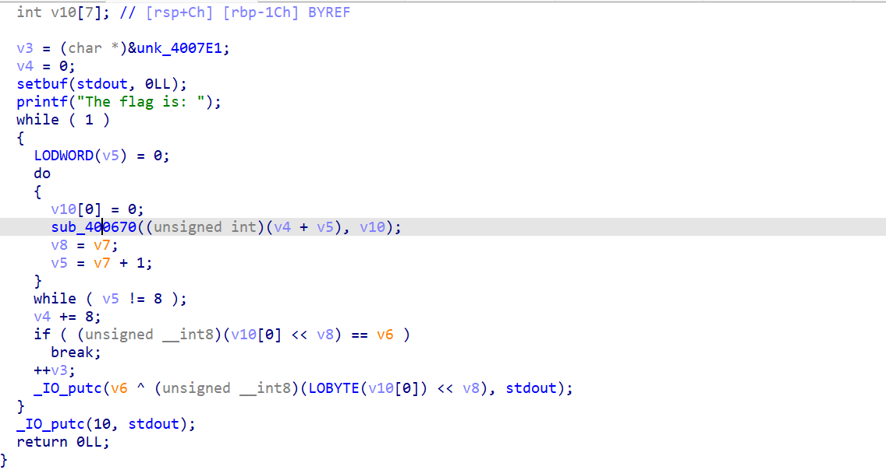

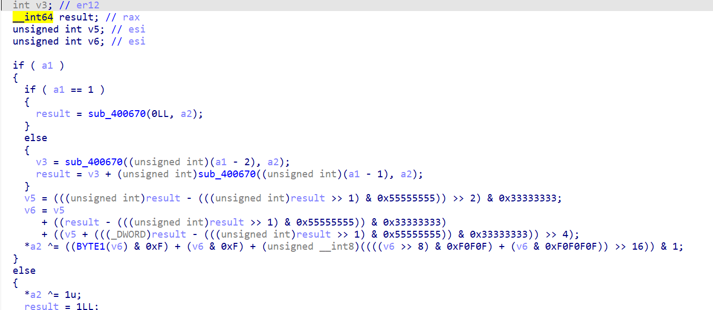

可以发现大量的递归调用使得flag的打印越来越慢

我们可以自己实现这个代码 进行记忆化加速 但这种较大规模的重构很容易出bug 而且很难debug
所以想法是用unicorn来模拟执行 并且加速

先是unicorn模拟执行源程序(先保证能跑)
[fibonacci.py](./unicorn/题目/fibonacci.py)
跟着wp好好学一学

第一遍正常写的流程
```py
from unicorn import *
from unicorn.x86_const import *
import struct
from pwn import *

# 读取文件内容
def read(name):
    with open(name,"rb") as f:
        return f.read()
    
# 初始化unicorn引擎
# 架构类型 架构说明  x86_64
mu = Uc(UC_ARCH_X86,UC_MODE_64)

# 二进制文件的基址
BASE = 0x400000
# 可以自主分配栈
STACK_ADDR = 0x0
STACK_SIZE = 1024*1024

# 映射内存
mu.mem_map(BASE,1024*1024)
mu.mem_map(STACK_ADDR,STACK_SIZE)

# 加载二进制文件到准备好的基址
mu.mem_write(BASE,read("./fibonacci"))

# 设置rsp指向我们自己分配的栈的底部
mu.reg_write(UC_X86_REG_RSP,STACK_ADDR + STACK_SIZE - 1)

# 模拟执行的开始地址和结束地址 main和IO_PUTC
mu.emu_start(0x4004E0,0x400575)
```

然而运行发现报错
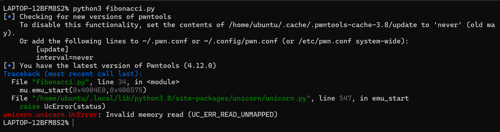

我们对指令加hook 看看为什么报错
在`mu.emu_start`前面加入
```py
# 加hook_code打印指令
# mu:Uc实例句柄  address:指令地址  size:执行的长度   user_data:用户自定义数据(可选传递)
def hook_code(mu,address,size,user_data):
    print("[+] Tracing instruction at 0x%x, instruction size = 0x%x" % (address,size))

mu.hook_add(UC_HOOK_CODE,hook_code)
```

再次运行 打印出错误的信息
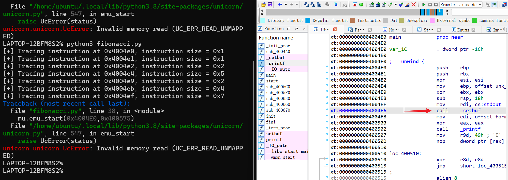

`.text:00000000004004EF                 mov     rdi, cs:stdout  ; stream`
其中`cs:stdout`在bss段上 我们没有分配

看IDAsetbuf的指令:
`.plt:00000000004004B0                 jmp     cs:off_601018`
我们并没有分配bss段的空间 所以unicorn执行的时候会报错
最简单的处理方法就是跳过这些指令

可以通过修改rip(64位)寄存器的方式来跳过
`mu.reg_write(UC_X86_REG_RIP, address+size)`

同理 最后输出打印flag的`__IO_putc`也要进行hook处理
```
.text:0000000000400558                 movsx   edi, dil        ; c
.text:000000000040055C                 add     rbp, 1
.text:0000000000400560                 call    __IO_putc
```
我们可以直接读取RDI寄存器的值跳过`__IO_putc`的输出

再次修改hook代码如下:
```py
# 加hook_code打印指令
# mu:Uc实例句柄  address:指令地址  size:执行的长度   user_data:用户自定义数据(可选传递)

def hook_code(mu:Uc,address,size,user_data):
    # print("[+] Tracing instruction at 0x%x, instruction size = 0x%x" % (address,size))
    skips = [0x00000000004004EF, 0x00000000004004F6, 0x0000000000400502, 0x000000000040054F]
    if address in skips:
        mu.reg_write(UC_X86_REG_RIP,address + size)
    elif address == 0x400560: # 跳过__IO_putc
        c = mu.reg_read(UC_X86_REG_RDI) # movsx   edi, dil        ; c
        print(chr(c),end='')
        mu.reg_write(UC_X86_REG_RIP,address + size)

mu.hook_add(UC_HOOK_CODE,hook_code)
```

能够正确模拟源程序了
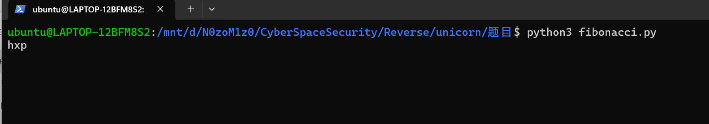


接下来进行加速
很容易想到用记忆化来优化程序
问题是怎么在unicorn里面实现(即在只有寄存器和内存的情况如何记忆化)

IDA看函数的参数对应的寄存器:
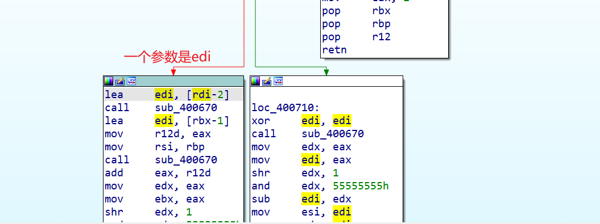

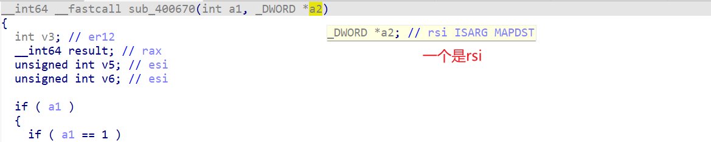

也就是EDI和RSI传参 函数的返回值是eax
所以我们可以开一个dict来记录两个参数是否在前面的状态出现过
出现过就找到对应值ret

我们对hook_code进行优化rewrite
流程:
每个Fibonacci开始前提取对应EDI RSI
- 若dp存过 取出dp中的值 把RAX的值和RSI对应的内存值write 然后设置rip跳转到retn返回
- 若没存过 继续执行 用栈保存当前寄存器等的值 递归直至回溯返回 然后pop取出栈顶值写入dp{}

细节:
- a2是`_DWORD *a2` 既是寄存器间接寻址也是按址传递(值会改变 所以才要写入`[RSI]`)
- retn不能用Fibonacci自己的 因为整个函数都被hook 所以我能选择main里面的gadget

具体实现看代码
```py
# 加hook_code打印指令
# mu:Uc实例句柄  address:指令地址  size:执行的长度   user_data:用户自定义数据(可选传递)

FIBONACCI_ENTRY = 0x400670
FIBONACCI_END = [0x4006F1,0x400709] # 两个retn处
stack = [] # 保存值的栈
dp = {} # 记忆化

def hook_code(mu:Uc,address,size,user_data):
    # print("[+] Tracing instruction at 0x%x, instruction size = 0x%x" % (address,size))
    skips = [0x00000000004004EF, 0x00000000004004F6, 0x0000000000400502, 0x000000000040054F]
    if address in skips:
        mu.reg_write(UC_X86_REG_RIP,address + size)
        
    elif address == 0x400560: # 跳过__IO_putc
        c = mu.reg_read(UC_X86_REG_RDI) # movsx   edi, dil        ; c
        print(chr(c&0xFF),end='')
        mu.reg_write(UC_X86_REG_RIP,address + size)

    elif address == FIBONACCI_ENTRY:
        arg0 = mu.reg_read(UC_X86_REG_RDI) # int a1
        # 注意 第二个是寄存器间接寻址
        r_rsi = mu.reg_read(UC_X86_REG_RSI)
        arg1 = u32(mu.mem_read(r_rsi,4)) # _DWORD *a2

        if (arg0,arg1) in dp: # 妙！ 以元组存dp
            (ret_rax,ret_ref) = dp[(arg0,arg1)] 
            mu.reg_write(UC_X86_REG_RAX,ret_rax) # 第一个参数赋值给RAX
            mu.mem_write(r_rsi,p32(ret_ref)) # 第二个参数写入rsi指向的地址中 mem_write
            # 设置返回点(rip)
            mu.reg_write(UC_X86_REG_RIP,0x400582) # 这里用的是main的ret指令
            # 为什么不能用fibonacci函数的 因为这个函数在hook中 所以不能跳到函数本身的ret指令
        else:
            stack.append((arg0,arg1,r_rsi)) # 不在dp数组就入栈
    # 遇到fibonacci函数的出口 从栈顶取数据建立映射
    elif address in FIBONACCI_END:
        (arg0,arg1,r_rsi) = stack.pop()
        ret_rax = mu.reg_read(UC_X86_REG_RAX)
        ret_ref = u32(mu.mem_read(r_rsi,4))
        dp[(arg0,arg1)] = (ret_rax,ret_ref)


mu.hook_add(UC_HOOK_CODE,hook_code)
```

[Fibonacci_improve](./unicorn/题目/fibonacci_improve.py)

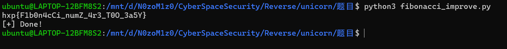

## task2
[完整代码](./unicorn/题目/task2.py)
分析下面的shellcode:
```py
shellcode = "\xe8\xff\xff\xff\xff\xc0\x5d\x6a\x05\x5b\x29\xdd\x83\xc5\x4e\x89\xe9\x6a\x02\x03\x0c\x24\x5b\x31\xd2\x66\xba\x12\x00\x8b\x39\xc1\xe7\x10\xc1\xef\x10\x81\xe9\xfe\xff\xff\xff\x8b\x45\x00\xc1\xe0\x10\xc1\xe8\x10\x89\xc3\x09\xfb\x21\xf8\xf7\xd0\x21\xd8\x66\x89\x45\x00\x83\xc5\x02\x4a\x85\xd2\x0f\x85\xcf\xff\xff\xff\xec\x37\x75\x5d\x7a\x05\x28\xed\x24\xed\x24\xed\x0b\x88\x7f\xeb\x50\x98\x38\xf9\x5c\x96\x2b\x96\x70\xfe\xc6\xff\xc6\xff\x9f\x32\x1f\x58\x1e\x00\xd3\x80"
```

其实这就可以看出unicorn在逆向分析病毒方面的作用了

首先可以用pwn.disasm看汇编 发现被混淆了
用unicorn模拟执行来明确逻辑
```
你可以HOOKint 80h指令，二进制代码是cd 80，然后读取寄存器和内存。
请记住，shellcode是可以在任何地址被加载执行的代码，绝大多数的shellcode使用栈来执行。
```


```py
from unicorn import *
from unicorn.x86_const import *
from pwn import *

shellcode = b"\xe8\xff\xff\xff\xff\xc0\x5d\x6a\x05\x5b\x29\xdd\x83\xc5\x4e\x89\xe9\x6a\x02\x03\x0c\x24\x5b\x31\xd2\x66\xba\x12\x00\x8b\x39\xc1\xe7\x10\xc1\xef\x10\x81\xe9\xfe\xff\xff\xff\x8b\x45\x00\xc1\xe0\x10\xc1\xe8\x10\x89\xc3\x09\xfb\x21\xf8\xf7\xd0\x21\xd8\x66\x89\x45\x00\x83\xc5\x02\x4a\x85\xd2\x0f\x85\xcf\xff\xff\xff\xec\x37\x75\x5d\x7a\x05\x28\xed\x24\xed\x24\xed\x0b\x88\x7f\xeb\x50\x98\x38\xf9\x5c\x96\x2b\x96\x70\xfe\xc6\xff\xc6\xff\x9f\x32\x1f\x58\x1e\x00\xd3\x80"

mu = Uc(UC_ARCH_X86,UC_MODE_32)

BASE = 0x400000
STACK_ADDR = 0x0
STACK_SIZE = 1024*1024

mu.mem_map(BASE,1024*1024)
mu.mem_map(STACK_ADDR,STACK_SIZE)

mu.mem_write(BASE,shellcode)

# 设置esp指向栈底
mu.reg_write(UC_X86_REG_ESP,STACK_ADDR + STACK_SIZE - 1)

def hook_code(mu:Uc,address,size,user_data):
    machine_code = mu.mem_read(address,size)
    # hook int 80
    if machine_code == b"\xcd\x80":
        r_eax = mu.reg_read(UC_X86_REG_EAX) # eax 系统调用号
        print(f"intercepted system call: {r_eax}")
        # 跳过int 80 (恶意代码)
        mu.reg_write(UC_X86_REG_EIP,address + size)

mu.hook_add(UC_HOOK_CODE,hook_code)
mu.emu_start(BASE,BASE+len(shellcode)*8)
```

结果:
```
intercepted system call: 15
intercepted system call: 1
```

15: chmod  1: exit

接下来继续对eax,ebx,ecx,edx四个寄存器进行hook输出 (汇编看到只用了这四个)
32位系统调用寄存器传参顺序: eax: 系统调用号 ebx，ecx，edx，esi，edi: 依次传参数
```py
def syscall_2_name(num:int):
    syscalls = {1:"sys_exit",15:"sys_chmod"}
    return syscalls[num]

def hook_code(mu:Uc,address,size,user_data):
    machine_code = mu.mem_read(address,size)
    # hook int 80
    if machine_code == b"\xcd\x80":
        r_eax = mu.reg_read(UC_X86_REG_EAX) # eax 系统调用号
        r_ebx = mu.reg_read(UC_X86_REG_EBX) # eax 系统调用号
        r_ecx = mu.reg_read(UC_X86_REG_ECX) # eax 系统调用号
        r_edx = mu.reg_read(UC_X86_REG_EDX) # eax 系统调用号

        syscall_name = syscall_2_name(r_eax)
        print(f"[+] intercepted system call: {syscall_name}")
        if syscall_name == "sys_chmod":
            # ebx,ecx
            s = mu.mem_read(r_ebx,20).split(b"\x00")[0]
            print(f"[+] arg0 = {hex(r_ebx)} -> {s}")
            print(f"[+] arg1 =  {oct(r_ecx)}")
        elif syscall_name == "sys_exit":
            print(f"arg0 = {hex(r_ebx)}")
        # 跳过int 80 (恶意代码)
        mu.reg_write(UC_X86_REG_EIP,address + size)
```

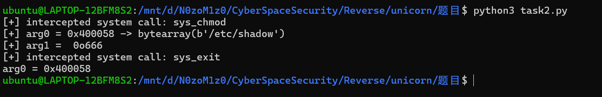

可以看到 shellcode对/etc/shadow加了666权限
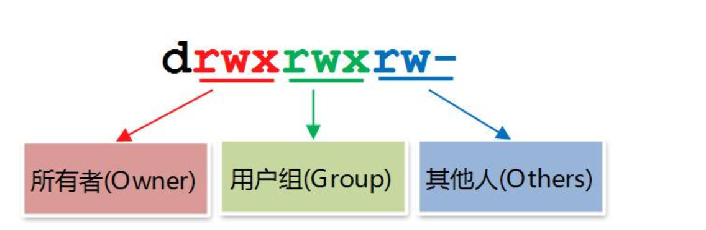

即 所有者&用户组&其他 都有读写权限

最后 结合capstone反汇编引擎打印完整汇编代码
```py
# 添加
from capstone import *

md = Cs(CS_ARCH_X86, CS_MODE_32)

# def hookcode() 中增加
for code in md.disasm(machine_code,address):
	print("     0x%x:\t%s\t%s" % (code.address, code.mnemonic, code.op_str))

```
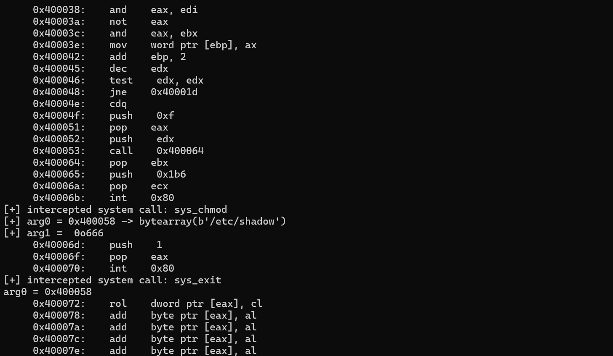

## task3
[function](./unicorn/题目/function)

源码如下:
```c
int strcmp(char *a, char *b)
{
    //get length
    int len = 0;
    char *ptr = a;
    while(*ptr)
    {
        ptr++;
        len++;
    }

    //comparestrings
    for(int i=0; i<=len; i++)
    {
        if (a[i]!=b[i])
            return 1;
    }

    return 0;
}

__attribute__((stdcall))
int  super_function(int a, char *b)
{
    if (a==5 && !strcmp(b, "batman"))
    {
        return 1;
    }
    return 0;
}

int main()
{
    super_function(1, "spiderman");
}
```

任务: 通过某种方法调用`super_function`使它返回1

32位elf stdcall调用参数从右到左依次入栈 我们hook参数来控制返回值

几个注意点:
- 我们这次模拟的基址是从0开始(IDA看) 起始点和结束点也有调整变化
- 32位栈传参我们通过esp来定位参数的位置并修改

具体看代码:
[function.py](./unicorn/题目/function.py)
```py
from unicorn import *
from unicorn.x86_const import *
import struct
from pwn import *
from capstone import *

def read(name):
    with open(name,"rb") as f:
        return f.read()

md = Cs(CS_ARCH_X86, CS_MODE_32)
mu = Uc(UC_ARCH_X86,UC_MODE_32)

BASE_ADDR = 0x0
STACK_ADDR = 0x400000
STACK_SIZE = 1024*1024

mu.mem_map(BASE_ADDR,1024*1024)
mu.mem_map(STACK_ADDR,STACK_SIZE)
mu.mem_write(BASE_ADDR,read("./function"))

mu.reg_write(UC_X86_REG_ESP,STACK_ADDR + STACK_SIZE - 1)

def hook_code(mu:Uc,address,size,user_data):
    machine_code = mu.mem_read(address,size)
    for code in md.disasm(machine_code,address):
	    print("     0x%x:\t%s\t%s" % (code.address, code.mnemonic, code.op_str))

    if address == 0x5CA: # call super_function
        STRING_ADDR = BASE_ADDR + 1024 # 随便找个内存写字符串
        mu.mem_write(STRING_ADDR,b"batman\x00")
        
        esp = mu.reg_read(UC_X86_REG_ESP) # 通过esp来定位栈
        mu.mem_write(esp+0,p32(5)) # 第一个参数
        mu.mem_write(esp+4,p32(STRING_ADDR)) # 第二个参数
        """ 
        ---
        arg1    <- esp+4
        ---
        arg0    <- esp    
        """
        pass

mu.hook_add(UC_HOOK_CODE,hook_code)
mu.emu_start(0x5B4,0x5B1) 
ret_val = mu.reg_read(UC_X86_REG_EAX)
print(f"[+] The return value is : {ret_val}")
```

成功使得函数返回1
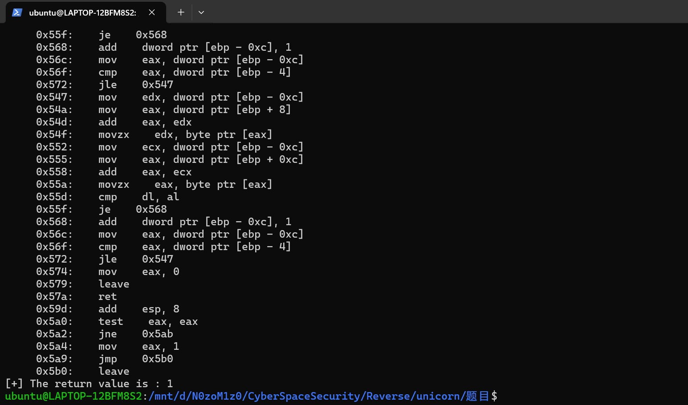

## task4
`ARM32` Little Endian 架构
与task1一样 都是用unicorn加速递归

```py
from unicorn import *
from unicorn.arm_const import *
import struct
from pwn import *
from capstone import *

def read(name):
    with open(name,"rb") as f:
        return f.read()

md = Cs(CS_ARCH_ARM, CS_MODE_LITTLE_ENDIAN)
mu = Uc(UC_ARCH_ARM,UC_MODE_LITTLE_ENDIAN) # ARM32 小端序

BASE_ADDR = 0x10000
STACK_ADDR = 0x400000
STACK_SIZE = 1024*1024

mu.mem_map(BASE_ADDR,1024*1024)
mu.mem_map(STACK_ADDR,STACK_SIZE)
mu.mem_write(BASE_ADDR,read("./task4"))

mu.reg_write(UC_ARM_REG_SP,STACK_ADDR + STACK_SIZE - 1)

CCC_ENTRY = 0X104D0
CCC_END = 0X10580
stack = [] # 保留regs
dp = {} # 记忆化

def hook_code(mu:Uc,address,size,user_data):
    # machine_code = mu.mem_read(address,size)
    # for code in md.disasm(machine_code,address):
	    # print("     0x%x:\t%s\t%s" % (code.address, code.mnemonic, code.op_str))
    if address == CCC_ENTRY:
        r0 = mu.reg_read(UC_ARM_REG_R0)
        reg0 = r0
        if reg0 in dp:
            ret_val = dp[reg0]    
            mu.reg_write(UC_ARM_REG_R0,ret_val) # 返回值也是R0
            mu.reg_write(UC_ARM_REG_PC,0x000105BC) # 改变PC-> ret 还是用main的ret
        else:
            stack.append(reg0)
    
    elif address == CCC_END:
        reg0 = stack.pop()
        ret_val = mu.reg_read(UC_ARM_REG_R0)
        dp[reg0] = ret_val
        

mu.hook_add(UC_HOOK_CODE,hook_code)
mu.emu_start(0x10584,0x00010594) 
print(f"[+] The answer is: {mu.reg_read(UC_ARM_REG_R3)}")
```

```shell
LAPTOP-12BFM8S2% python3 task4.py
[+] The answer is: 2635833876
```


## [YCB2021]OddCode
参考:
[羊城杯_2021 OddCode 天堂之门 + unicorn反混淆](https://www.cnblogs.com/lordtianqiyi/articles/16511719.html)
[EarthMan](https://bbs.kanxue.com/thread-269328.htm)

### 一.天堂之门
程序用了天堂之门和一大堆junkcode来混淆 IDA静态很不好分析

在输入完进行flag格式的check后有一处识别错误的远跳转
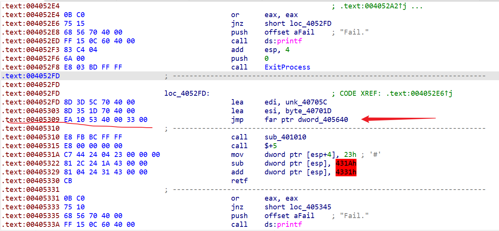

看机器码知道应该继续`405310` 但由于这里把cs段寄存器设置了33 切换成了64位导致IDA识别出错
而且跟以前见的天堂之门的题目不一样 这题还有很多花指令 很难处理 动态调试也很不方便

### 二.unicorn模拟执行
所以采用unicorn模拟执行 来hook打印一些关键信息辅助我们分析
当然我觉得应该用调试器自带的trace也能看 但杂乱信息太多 而且不好过滤花指令 所以还是先跟着wp用unicorn来实现
unicorn可以记录指令地址/跳转地址 对于一些花指令的处理更加好判断

**Q:如何通过unicorn过滤花指令?**
A: 正常指令: address + size = next_address
    所以利用unicorn记录的值就可以来过滤无效重复的花指令

首先hook查看函数的转移地址 来看程序对input和key的地址有什么处理
这里的写法与先前几个task不完全一样 理解原理才是最主要的 (主要是因为这个程序是PE... 有PE头...)
具体见代码/注释:

自己调试寄存器出了点bug...
```py
from unicorn import *
from unicorn.x86_const import *
from struct import *

with open(r"./OddCode.exe","rb") as f:
    f.seek(0x400) # CFF看HEX可以看到从0x400处才是数据段 前面是PE头
    X64code = f.read(0x4269)

ADDRESS = 0x00540000
"""
        .text:005452FD loc_5452FD:                             ; CODE XREF: .text:005452E6↑j
        .text:005452FD lea     edi, unk_54705C
8        .text:00545303 lea     esi, byte_54701D
        .text:00545309 jmp     far ptr dword_545640
"""
# 可以看到两个lea一个取了flag另一个取了一个16字节数组 猜测是key
INPUT_ADDR = 0x54701D
KEY_ADDR = 0x54705C

class UniVm:
    def __init__(self,flag):
        # 虽然32位64位都有 但64位架构两者都能跑
        mu = Uc(UC_ARCH_X86,UC_MODE_64)

        mu.mem_map(ADDRESS,0x1000000)
        mu.mem_write(ADDRESS,X64code)
        mu.mem_write(INPUT_ADDR,flag)
        mu.mem_write(KEY_ADDR,b'\x90\xF0\x70\x7C\x52\x05\x91\x90\xAA\xDA\x8F\xFA\x7B\xBC\x79\x4D')
        # 下面初始化寄存器 寄存器的状态选择切换到64位架构之前的值 通过IDA动调得到对应的值
        # 注意都要把IDA里面32位寄存器的名字改为64位寄存器的名字 e->r
        mu.reg_write(UC_X86_REG_RAX, 1)
        mu.reg_write(UC_X86_REG_RBX, 0x006F702D)
        mu.reg_write(UC_X86_REG_RCX, 0x3F10B009)
        mu.reg_write(UC_X86_REG_RDX, 1) # 这里自己调试始终是1...

        mu.reg_write(UC_X86_REG_RSI, INPUT_ADDR)  # input
        mu.reg_write(UC_X86_REG_RDI, KEY_ADDR)    # key

        mu.reg_write(UC_X86_REG_RBP, 0x008FF99C)
        mu.reg_write(UC_X86_REG_RSP, 0x008FF98C)
        mu.reg_write(UC_X86_REG_RIP, 0x545310)

        mu.hook_add(UC_HOOK_CODE,self.trace)
        self.mu = mu
        self.expect_addr = 0
        self.traces = [] # 保存执行轨迹
    
    def trace(self,mu,address,size,user_data):
        if address != self.expect_addr:
            self.traces.append(address)
        self.expect_addr = address + size
    
    def start(self):
        try:
            self.mu.emu_start(0x545310,-1)
        except:
            pass
        
        print([hex(addr) for addr in self.traces])

UniVm(b'SangFor{00000000000000000000000000000000}').start()
```

没跑出来 edx那里始终是1 就离谱
改magic 64位IDA跑也得不到edx...
先分析wp给的代码吧

```py
from unicorn import *
from unicorn.x86_const import *
 
ADDRESS = 0x2E1000          # 程序加载的地址
INPUT_ADDRESS = 0x2E701D    # 输入的地址
KEY_ADDRESS = 0x2E705C      # 16字节key的地址
with open('./OddCode.exe', 'rb') as file:
    file.seek(0x400)
    X64_CODE = file.read(0x4269)    # 读取代码
 
class Unidbg:
 
    def __init__(self, flag):
        mu = Uc(UC_ARCH_X86, UC_MODE_64)
        # 基址为0x2E1000，分配16MB内存
        mu.mem_map(ADDRESS, 0x1000000)
        mu.mem_write(ADDRESS, X64_CODE)
        mu.mem_write(INPUT_ADDRESS, flag)       # 随便写入一个flag
        mu.mem_write(KEY_ADDRESS, b'\x90\xF0\x70\x7C\x52\x05\x91\x90\xAA\xDA\x8F\xFA\x7B\xBC\x79\x4D')
        # 初始化寄存器，寄存器的状态就是切换到64位模式之前的状态，可以通过动调得到
        mu.reg_write(UC_X86_REG_RAX, 1)
        mu.reg_write(UC_X86_REG_RBX, 0x51902D)
        mu.reg_write(UC_X86_REG_RCX, 0xD86649D8)
        mu.reg_write(UC_X86_REG_RDX, 0x2E701C)
        mu.reg_write(UC_X86_REG_RSI, INPUT_ADDRESS)  # input参数
        mu.reg_write(UC_X86_REG_RDI, KEY_ADDRESS)    # key参数
        mu.reg_write(UC_X86_REG_RBP, 0x6FFBBC)
        mu.reg_write(UC_X86_REG_RSP, 0x6FFBAC)
        mu.reg_write(UC_X86_REG_RIP, 0x2E1010)
        mu.hook_add(UC_HOOK_CODE, self.trace)        # hook代码执行，保存代码块执行轨迹
        self.mu = mu
        self.except_addr = 0
        self.traces = []        # 用来保存代码块执行轨迹
 
    def trace(self, mu, address, size, data):
        # --过滤花指令--
        if address != self.except_addr:
            self.traces.append(address)
        self.except_addr = address + size
 
    def start(self):
        try:
            self.mu.emu_start(0x2E1010, -1)
        except:
            pass
        print([hex(addr)for addr in self.traces])
 
Unidbg(b'SangFor{00000000000000000000000000000000}').start()
```

得到了一堆轨迹 我们通过判断hook记录的address的值是否在input和key的地址内来看看对input和key作了哪些操作
加一个hook_mem_read 在读取内存的时候判断

```py
mu.hook_add(UC_HOOK_MEM_READ,self.hook_mem_read)
def hook_mem_read(self, mu:Uc, access,address, size, value,data):
    if address >= INPUT_ADDRESS and address <= INPUT_ADDRESS + 41:
        print(f"[+] Read input[{address-INPUT_ADDRESS}] at {hex(mu.reg_read(UC_X86_REG_RIP))}")
    if address >= KEY_ADDRESS and address <= KEY_ADDRESS + 15:
        print(f"[+] Read key[{address-KEY_ADDRESS}] at {hex(mu.reg_read(UC_X86_REG_RIP))}")
```

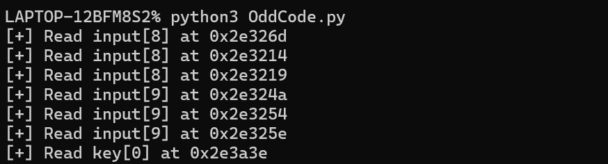

这里能够猜测以两位一组进行check
而且cmp失败后不会继续check 直接退出

我IDA也反编译不正确 看不了对应地址的正确指令...
直接借图
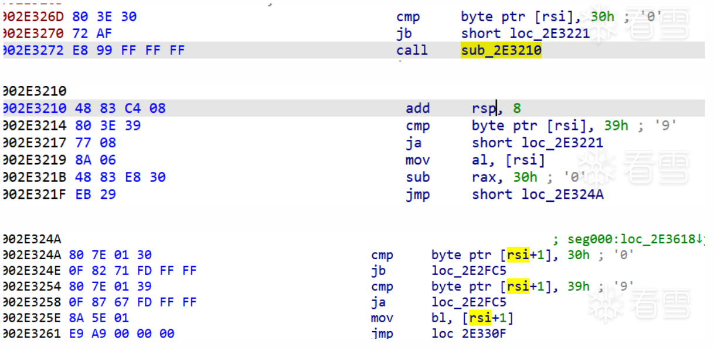

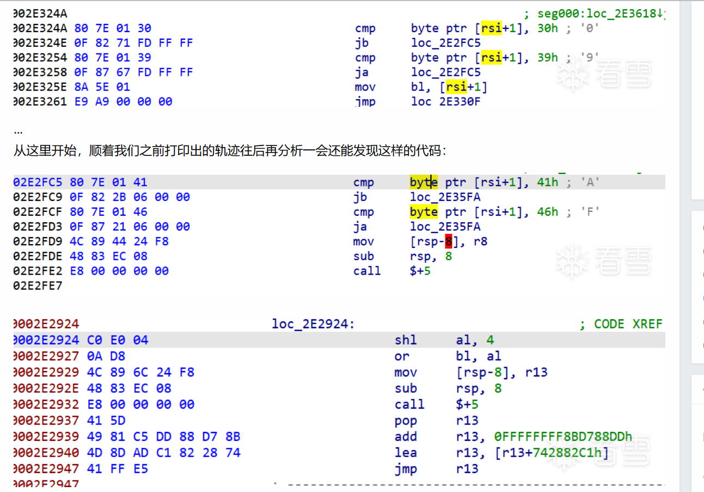

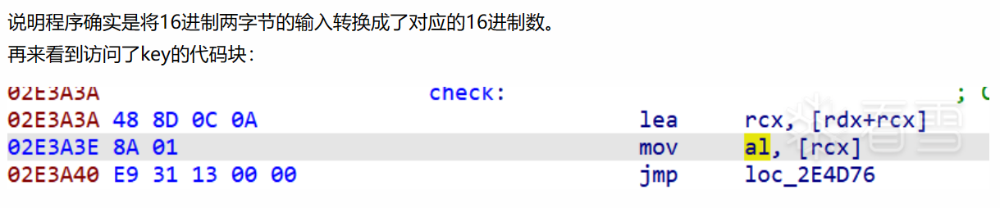

改一改trace函数 结合capstone找到执行的cmp和test指令的地址
```py
def trace(self, mu, address, size, data):
        disasm = self.md.disasm(mu.mem_read(address, size), address)
        for i in disasm:
            mnemonic = i.mnemonic
            if mnemonic == 'cmp' or mnemonic == 'test':
                print(f'Instruction {mnemonic} at {hex(address)}')
        if address != self.except_addr:
            self.traces.append(address)
        self.except_addr = address + size
```

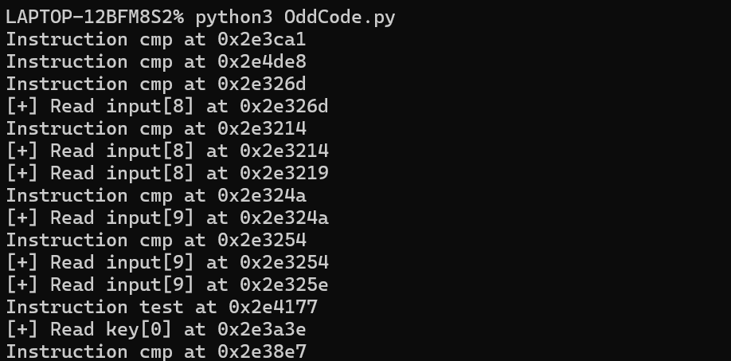

可以看到在读取了key过后只进行了一次cmp
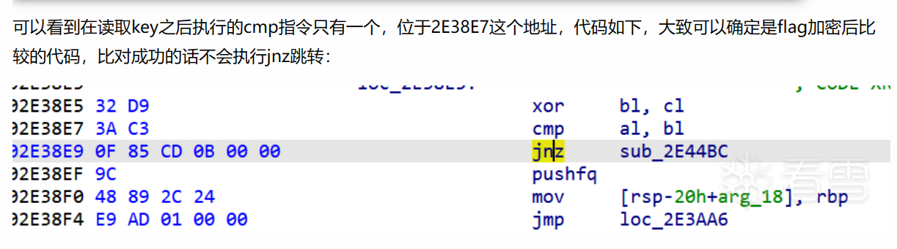
如果执行成功 就不会jnz跳转 所以可以根据到达多少次`2E38EF`来进行爆破
(其实分析到这里后也可以用pintool来爆破)

**无法反编译**
其实想了想可以capstone打印出中间的汇编代码... (这本来也就是我们用unicorn的目的之一: 过滤花指令 还原真实程序流)
[asm.py](./unicorn/题目/asm.py)
[asm.txt](./unicorn/题目/asm.txt)

读取input:

```
     0x2e3254:	cmp	byte ptr [rsi + 1], 0x39
     0x2e3258:	ja	0x2e2fc5
     0x2e325e:	mov	bl, byte ptr [rsi + 1]
```

读取key后的cmp:
```
     0x2e38e7:	cmp	al, bl
     0x2e38e9:	jne	0x2e44bc
```

这就很清楚了

### 三.爆破flag
改一改trace:
```py
    def trace(self, mu:Uc, address, size, data):
        # disasm = self.md.disasm(mu.mem_read(address, size), address)
        # for i in disasm:
        #     mnemonic = i.mnemonic
        #     if mnemonic == 'cmp' or mnemonic == 'test':
        #         print(f'Instruction {mnemonic} at {hex(address)}')
        if address != self.except_addr:
            self.traces.append(address)
        self.except_addr = address + size

        if address == 0x2E38EF:
            self.hit += 1
            if self.hit == self.expect_hit:
                self.success = 1
                mu.emu_stop()
```

爆破:
```py
def brute4flag(flag,expect_hit):
    for i in b"1234567890abcdefABCDEF":
        for j in b"1234567890abcdefABCDEF":
            flag[8 + (expect_hit-1)*2] = i
            flag[8 + (expect_hit-1)*2 + 1] = j
            if Unidbg(bytes(flag),expect_hit).solve():
                return 
```

getflag!
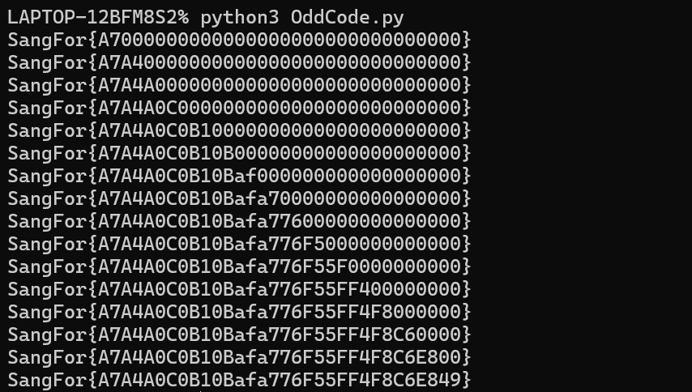

[完整代码](./unicorn/题目/OddCode.py)

---
---
妙极！
等后面找时间再试试能不能调出寄存器的值...
orz